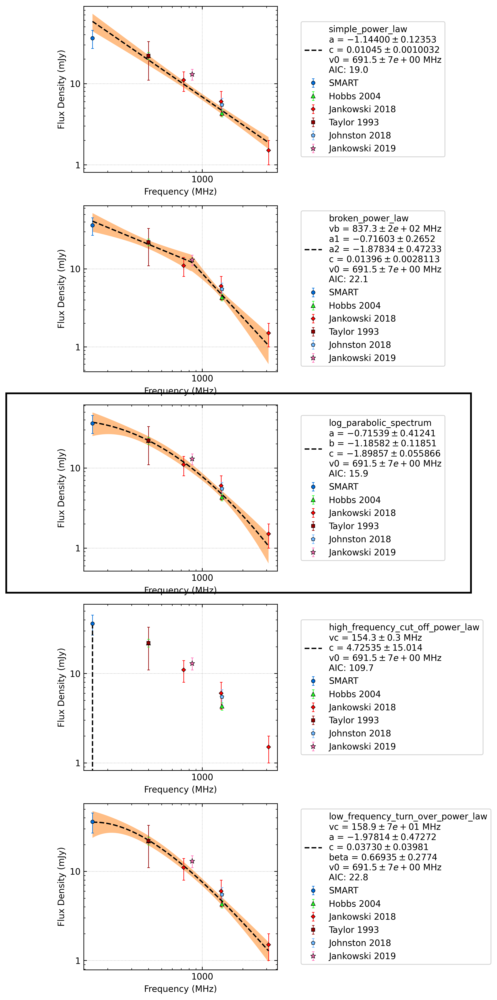

J0924-5814
==========

Best Fit
--------
.. image:: best_fits/J0924-5814_log_parabolic_spectrum_fit.png
  :width: 800

.. csv-table:: J0924-5814 fit results
   :header: "model","a","b","c"

   "log_parabolic_spectrum","-0.82±0.42","-1.65±0.28","-2.29±0.04"

Fit Before MWA
--------------
.. image:: before_mwa/J0924-5814_simple_power_law_fit.png
  :width: 800

.. csv-table:: J0924-5814 before fit results
   :header: "model","a","b"

   "simple_power_law","-1.30±0.10","0.00±0.00"

Flux Density Results
--------------------
.. csv-table:: J0924-5814 flux density total results
   :header: "N obs", "Flux Density (mJy)", "u_S_mean", "u_scint", "m_r_v"

   "2",  "32.0±12.0", "8.1", "12.1", "0.378"

.. csv-table:: J0924-5814 flux density individual results
   :header: "ObsID", "Flux Density (mJy)"

    "1266329600", "38.7±6.7"
    "1266932744", "25.3±4.6"

Comparison Fit
--------------

Detection Plots
---------------

.. image:: on_pulse_plots/1266329600_J0924-5814_256_bins_gaussian_components.png
  :width: 800

.. image:: on_pulse_plots/1266932744_J0924-5814_256_bins_gaussian_components.png
  :width: 800