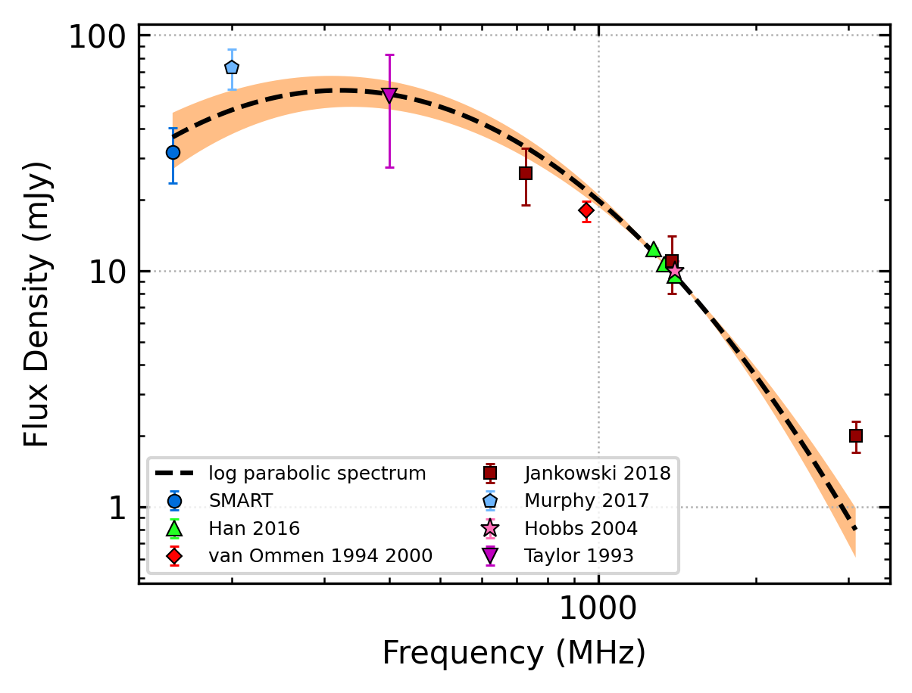
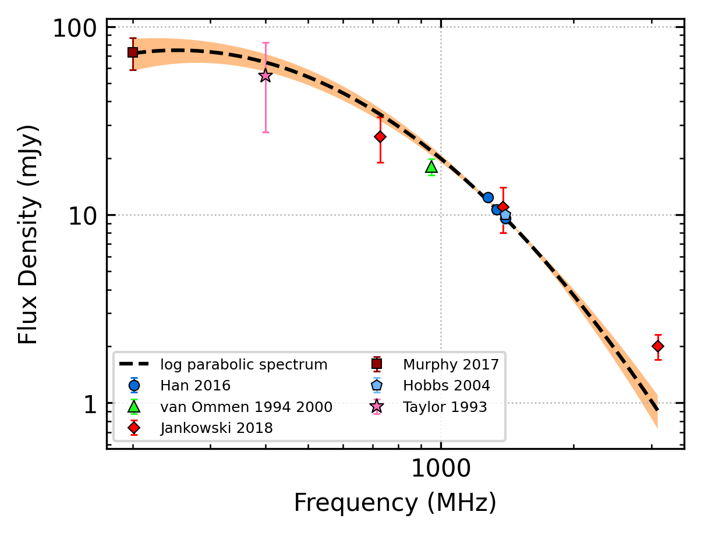
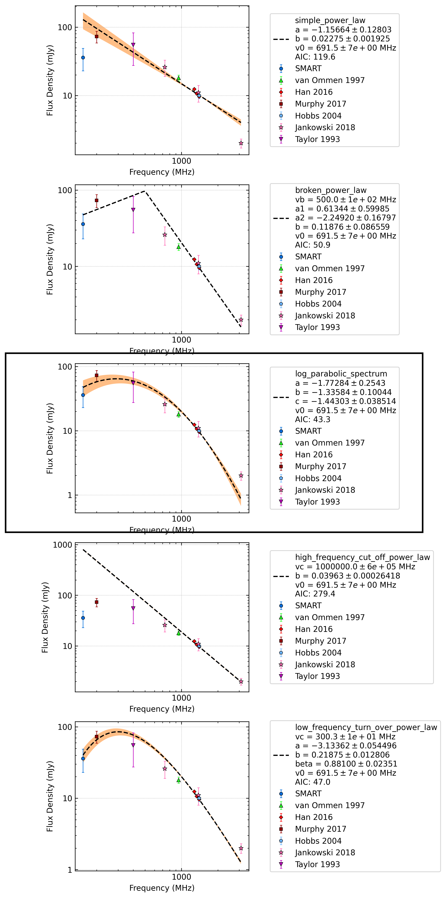
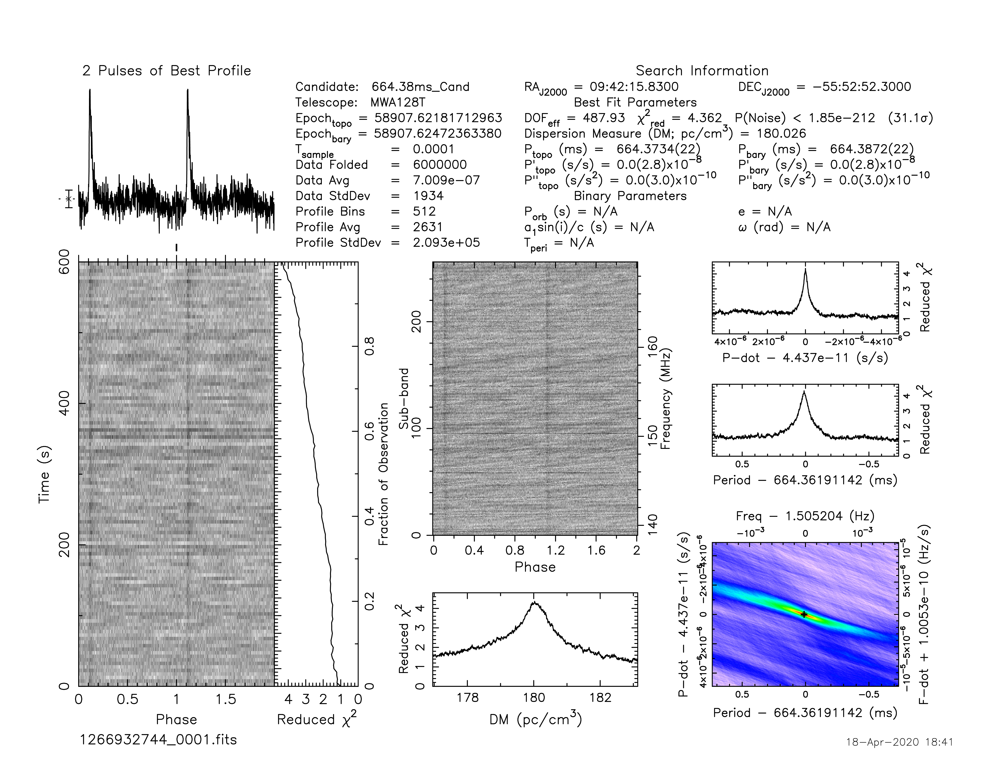

J0942-5552
==========

Best Fit
--------

.. csv-table:: J0942-5552 fit results
   :header: "model","a","b","c"

   "log_parabolic_spectrum","-1.93±0.27","-2.34±0.20","-1.94±0.01"

Fit Before MWA
--------------

.. csv-table:: J0942-5552 before fit results
   :header: "model","a","b","c"

   "log_parabolic_spectrum","-1.61±0.25","-2.30±0.16","-1.94±0.00"

Flux Density Results
--------------------
.. csv-table:: J0942-5552 flux density total results
   :header: "N obs", "Flux Density (mJy)", " u_S_mean", "u_scint", "m_r_v"

   "1",  "31.9±8.4", "4.7", "7.0", "0.221"

.. csv-table:: J0942-5552 flux density individual results
   :header: "ObsID", "Flux Density (mJy)"

    "1265983624", "nan±nan"
    "1266932744", "31.9±4.7"

Comparison Fit
--------------

Detection Plots
---------------

.. image:: on_pulse_plots/1266932744_J0942-5552_512_bins_gaussian_components.png
  :width: 800