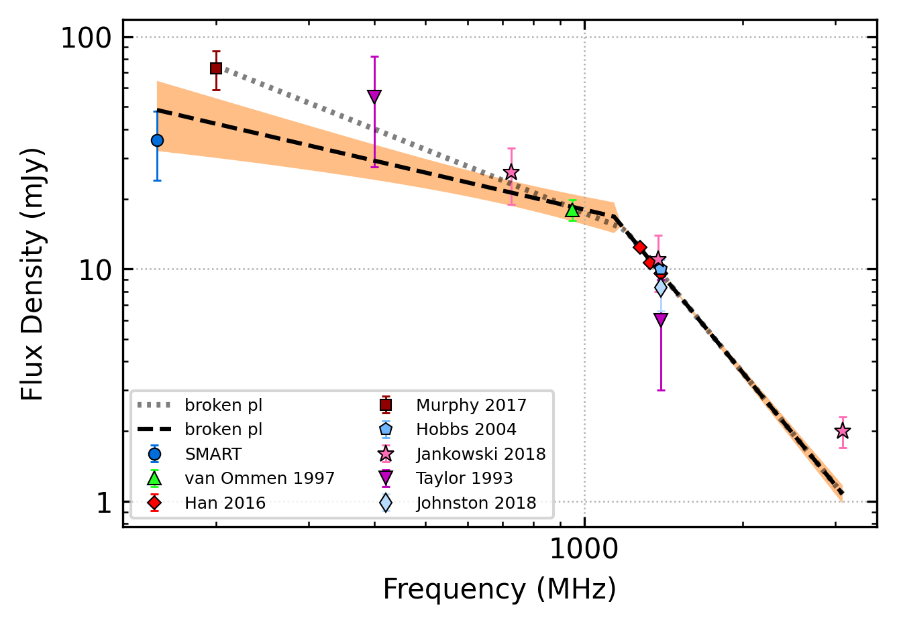
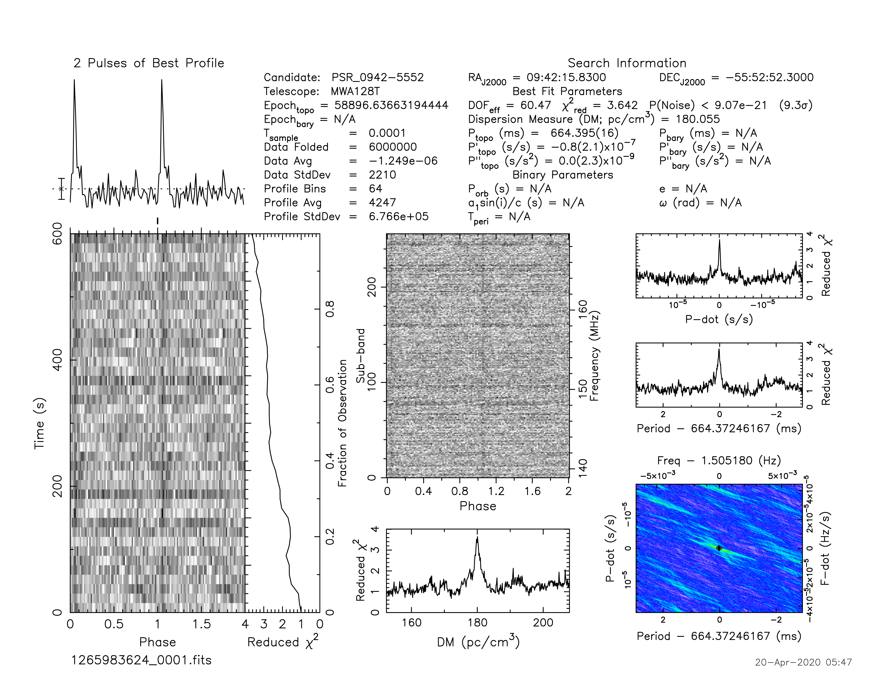

.. _J0942-5552:
J0942-5552
==========

Best Fit
--------

.. csv-table:: J0942-5552 fit results
   :header: "model","a","b","c","v0 (MHz)"

   "log_parabolic_spectrum","-1.78±0.25","-1.34±0.10","-1.44±0.04","691±6"

Fit Before MWA
--------------

.. csv-table:: J0942-5552 before fit results
   :header: "model","vb (MHz)","a1","a2","b","v0 (MHz)"

   "broken_power_law","1192±103","-0.90±0.19","-2.75±0.11","0.02±0.00","787±7"

Flux Density Results
--------------------
.. csv-table:: J0942-5552 flux density total results
   :header: "N obs", "Flux Density (mJy)", "u_S_mean", "u_scint", "m_r_v"

   "2",  "35.9±12.9", "11.9", "7.9", "0.221"

.. csv-table:: J0942-5552 flux density individual results
   :header: "ObsID", "Flux Density (mJy)"

    "1265983624", "34.6±10.6"
    "1266932744", "37.3±5.4"

Comparison Fit
--------------
.. image:: comparison_fits/J0942-5552_comparison_fit.png
  :width: 800

Detection Plots
---------------

.. image:: on_pulse_plots/1265983624_J0942-5552_64_bins_gaussian_components.png
  :width: 800
.. image:: detection_plots/1266932744_J0942-5552.prepfold.png
  :width: 800

.. image:: on_pulse_plots/1266932744_J0942-5552_512_bins_gaussian_components.png
  :width: 800