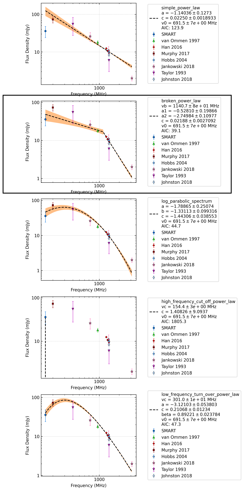

.. _J0942-5552:
J0942-5552
==========

Best Fit
--------
.. image:: best_fits/J0942-5552_broken_power_law_fit.png
  :width: 800

.. csv-table:: J0942-5552 fit results
   :header: "model","vb (MHz)","a1","a2","b"

   "broken_power_law","1135±50","-0.40±0.18","-2.73±0.14","0.02±0.00"

Fit Before MWA
--------------
.. image:: before_mwa/J0942-5552_log_parabolic_spectrum_fit.png
  :width: 800

.. csv-table:: J0942-5552 before fit results
   :header: "model","a","b","c"

   "log_parabolic_spectrum","-5.00±5.98","-2.42±0.23","-1.94±0.01"

Flux Density Results
--------------------
.. csv-table:: J0942-5552 flux density total results
   :header: "N obs", "Flux Density (mJy)", "u_S_mean", "u_scint", "m_r_v"

   "1",  "31.9±8.4", "4.7", "7.0", "0.221"

.. csv-table:: J0942-5552 flux density individual results
   :header: "ObsID", "Flux Density (mJy)"

    "1265983624", "nan±nan"
    "1266932744", "31.9±4.7"

Comparison Fit
--------------

Detection Plots
---------------

.. image:: on_pulse_plots/1266932744_J0942-5552_512_bins_gaussian_components.png
  :width: 800