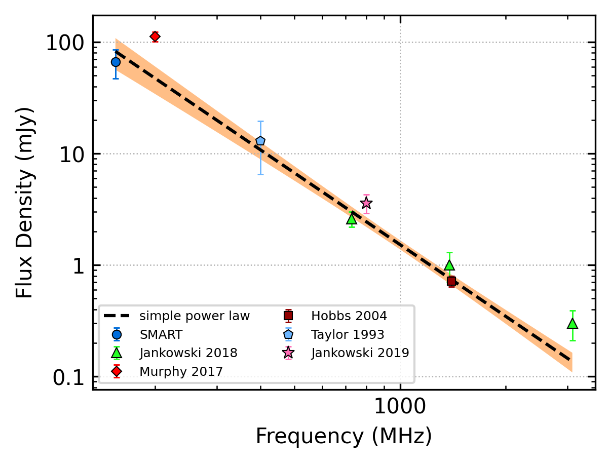
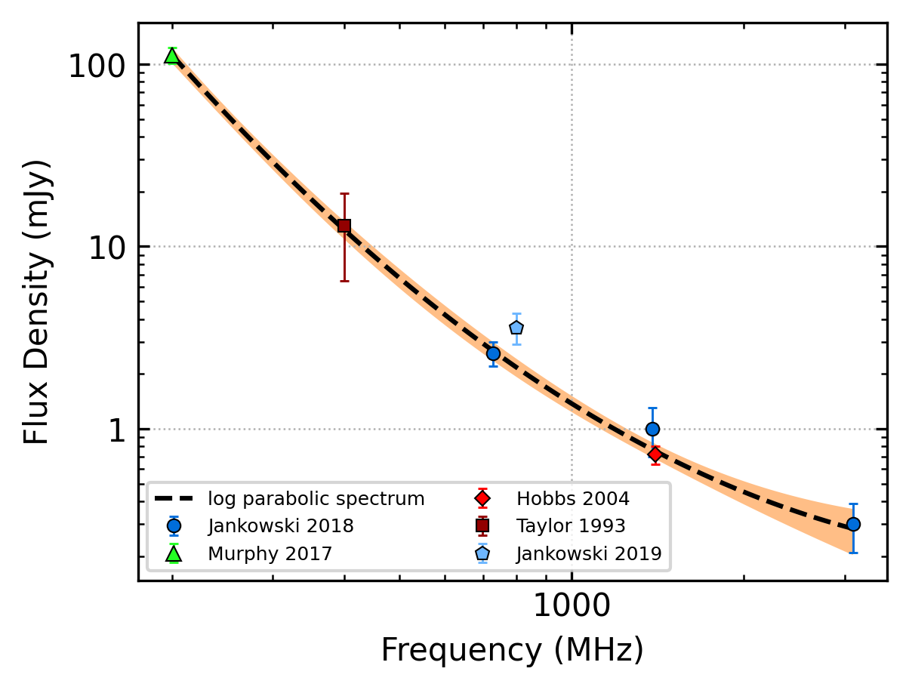
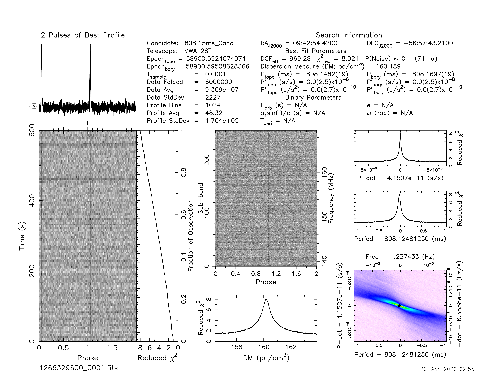
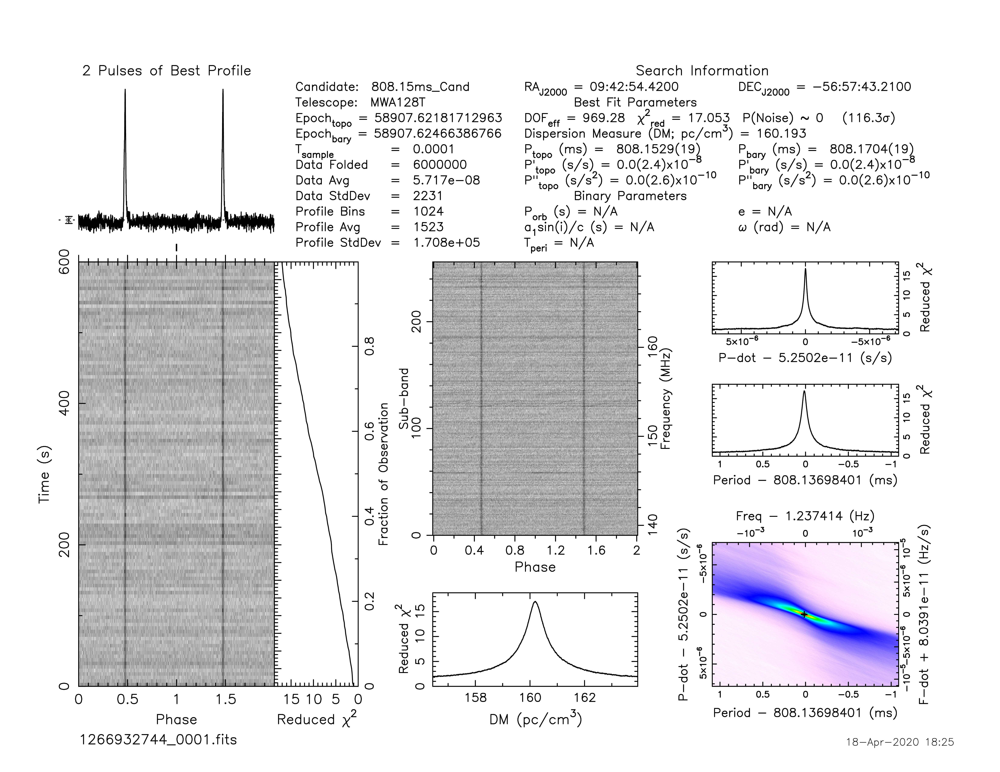
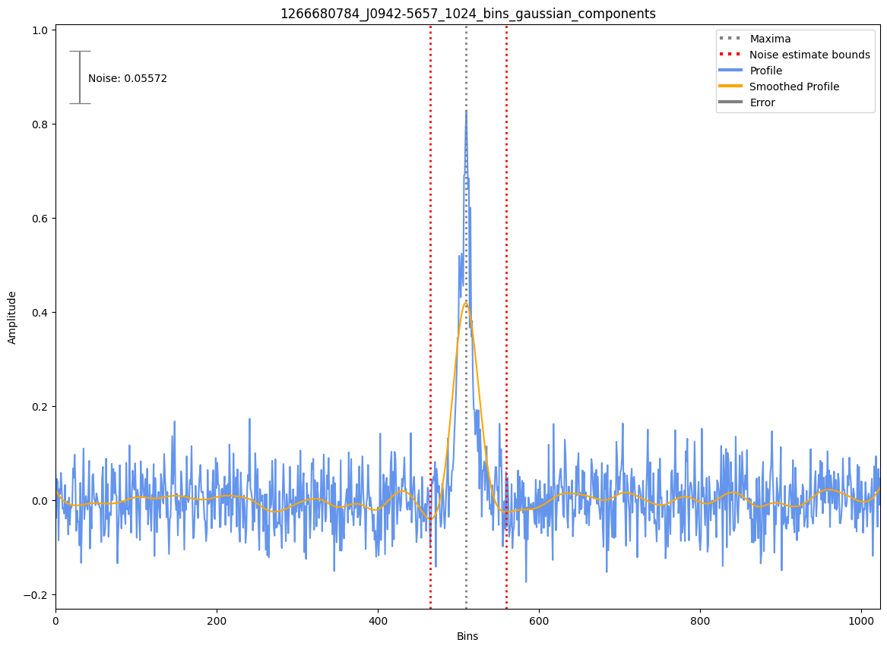

J0942-5657
==========

Best Fit
--------

.. csv-table:: J0942-5657 fit results
   :header: "model","a","b"

   "simple_power_law","-2.14±0.16","0.00±0.00"

Fit Before MWA
--------------

.. csv-table:: J0942-5657 before fit results
   :header: "model","a","b","c"

   "log_parabolic_spectrum","1.13±0.27","-1.69±0.21","-3.07±0.04"

Flux Density Results
--------------------
.. csv-table:: J0942-5657 flux density total results
   :header: "N obs", "Flux Density (mJy)", "u_S_mean", "u_scint", "m_r_v"

   "3",  "66.3±19.2", "14.1", "15.5", "0.233"

.. csv-table:: J0942-5657 flux density individual results
   :header: "ObsID", "Flux Density (mJy)"

    "1266329600", "78.0±9.3"
    "1266932744", "81.4±9.1"
    "1266680784", "39.5±5.4"

Comparison Fit
--------------
.. image:: comparison_fits/J0942-5657_comparison_fit.png
  :width: 800

Detection Plots
---------------

.. image:: on_pulse_plots/1266329600_J0942-5657_1024_bins_gaussian_components.png
  :width: 800

.. image:: on_pulse_plots/1266932744_J0942-5657_1024_bins_gaussian_components.png
  :width: 800
.. image:: detection_plots/1266680784_J0942-5657.prepfold.png
  :width: 800

