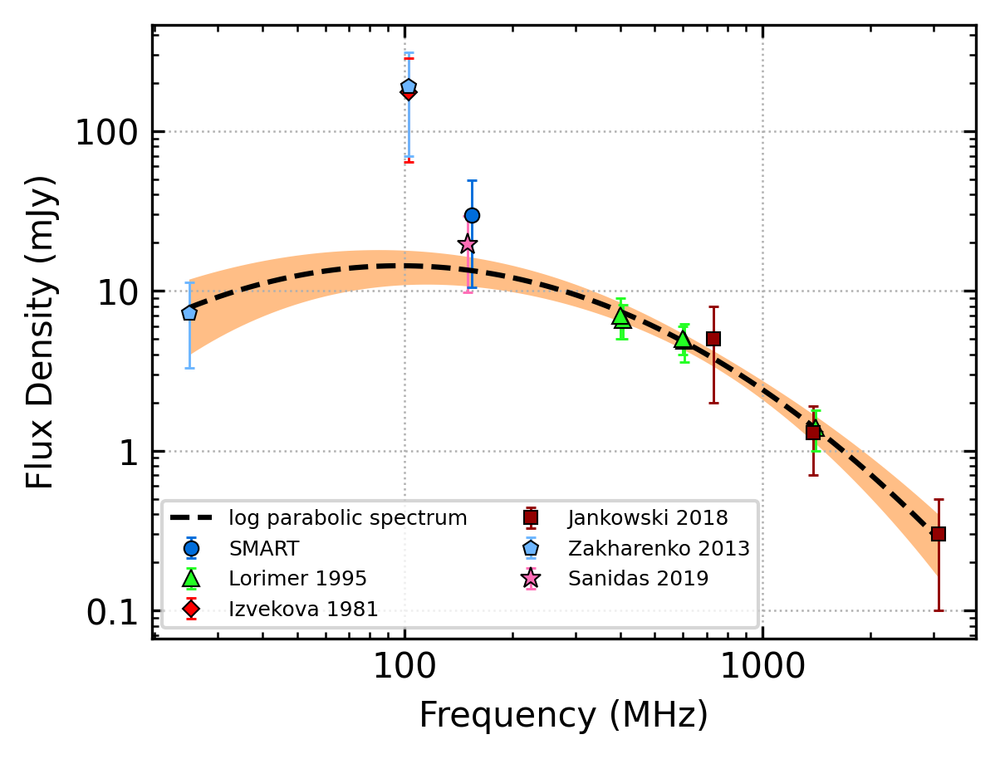
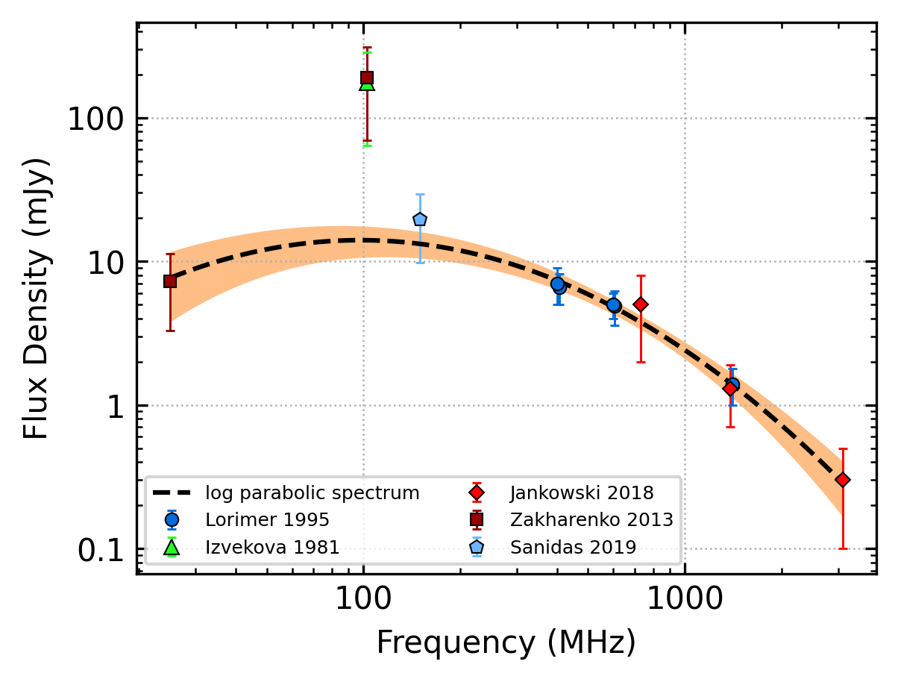
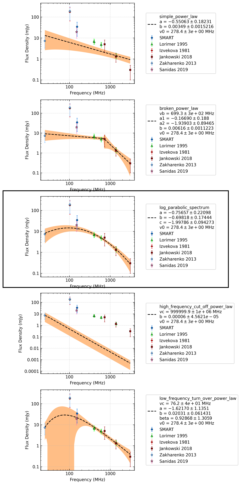
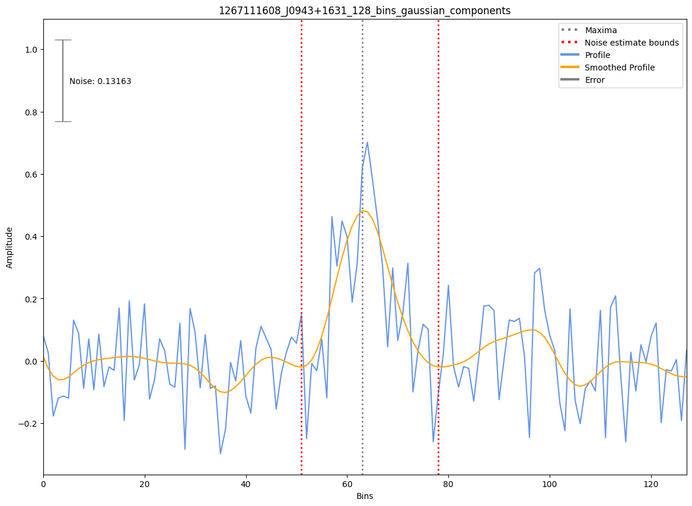

.. _J0943+1631:
J0943+1631
==========

Best Fit
--------

.. csv-table:: J0943+1631 fit results
   :header: "model","a","b","c","v0 (MHz)"

   "log_parabolic_spectrum","-0.76±0.22","-0.70±0.17","-2.00±0.09","278±2"

Fit Before MWA
--------------

.. csv-table:: J0943+1631 before fit results
   :header: "model","a","b","c","v0 (MHz)"

   "log_parabolic_spectrum","-0.75±0.22","-0.69±0.18","-2.00±0.09","278±2"

Flux Density Results
--------------------
.. csv-table:: J0943+1631 flux density total results
   :header: "N obs", "Flux Density (mJy)", "u_S_mean", "u_scint", "m_r_v"

   "1",  "34.2±22.2", "6.9", "21.1", "0.615"

.. csv-table:: J0943+1631 flux density individual results
   :header: "ObsID", "Flux Density (mJy)"

    "1267111608", "34.2±6.9"

Comparison Fit
--------------

Detection Plots
---------------

.. image:: detection_plots/1267111608_J0943+1631.prepfold.png
  :width: 800

