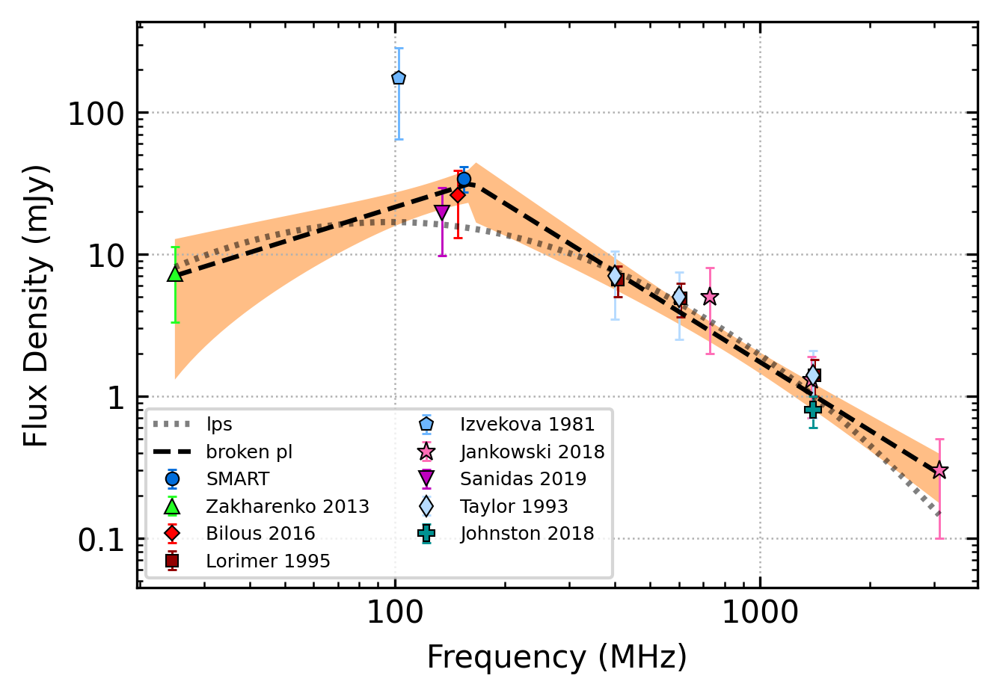
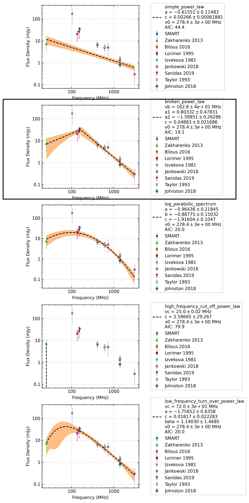
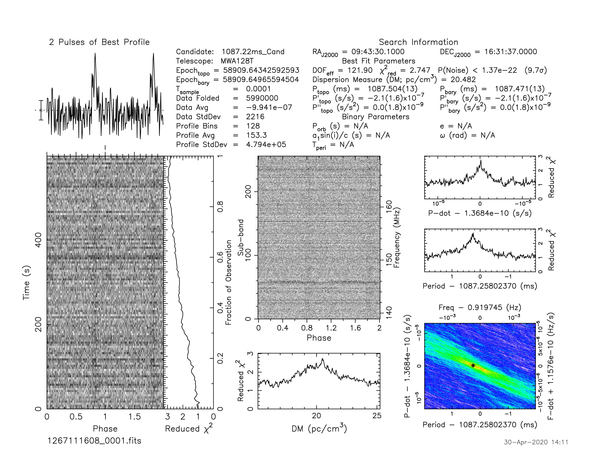

.. _J0943+1631:
J0943+1631
==========

Best Fit
--------

.. csv-table:: J0943+1631 fit results
   :header: "model","vpeak (MHz)","a","c","beta","v0 (MHz)"

   "low_frequency_turn_over_power_law","81±30","-2.18±1.75","0.05±0.32","0.67±1.29","278±2"

Fit Before MWA
--------------

.. csv-table:: J0943+1631 before fit results
   :header: "model","vpeak (MHz)","a","c","beta","v0 (MHz)"

   "low_frequency_turn_over_power_law","83±34","-2.30±2.36","0.08±0.99","0.60±1.23","278±2"

Flux Density Results
--------------------
.. csv-table:: J0943+1631 flux density total results
   :header: "N obs", "Flux Density (mJy)", "u_S_mean", "u_scint", "m_r_v"

   "1",  "34.2±22.2", "6.9", "21.1", "0.615"

.. csv-table:: J0943+1631 flux density individual results
   :header: "ObsID", "Flux Density (mJy)"

    "1267111608", "34.2±6.9"

Comparison Fit
--------------

Detection Plots
---------------

.. image:: on_pulse_plots/1267111608_J0943+1631_128_bins_gaussian_components.png
  :width: 800