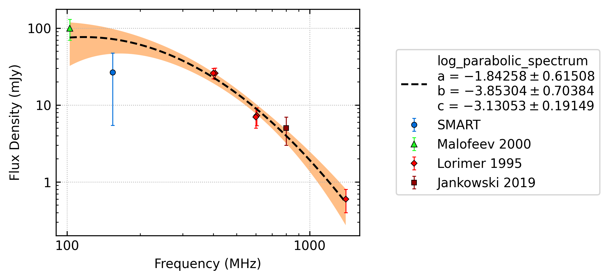
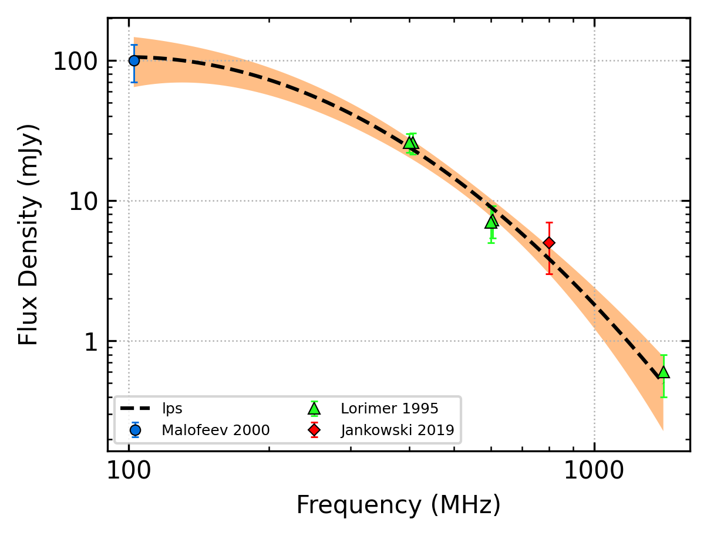

.. _J0944-1354:
J0944-1354
==========

Best Fit
--------

.. csv-table:: J0944-1354 fit results
   :header: "model","a","b","c"

   "log_parabolic_spectrum","-1.83±0.57","-3.83±0.57","-3.12±0.14"

Fit Before MWA
--------------

.. csv-table:: J0944-1354 before fit results
   :header: "model","a","b","c"

   "log_parabolic_spectrum","-1.75±0.43","-3.90±0.57","-3.15±0.17"

Flux Density Results
--------------------
.. csv-table:: J0944-1354 flux density total results
   :header: "N obs", "Flux Density (mJy)", "u_S_mean", "u_scint", "m_r_v"

   "1",  "23.3±18.5", "4.2", "18.0", "0.773"

.. csv-table:: J0944-1354 flux density individual results
   :header: "ObsID", "Flux Density (mJy)"

    "1267283936", "23.3±4.2"

Comparison Fit
--------------
.. image:: comparison_fits/J0944-1354_comparison_fit.png
  :width: 800

Detection Plots
---------------

.. image:: detection_plots/1267283936_J0944-1354.prepfold.png
  :width: 800

.. image:: on_pulse_plots/1267283936_J0944-1354_1024_bins_gaussian_components.png
  :width: 800