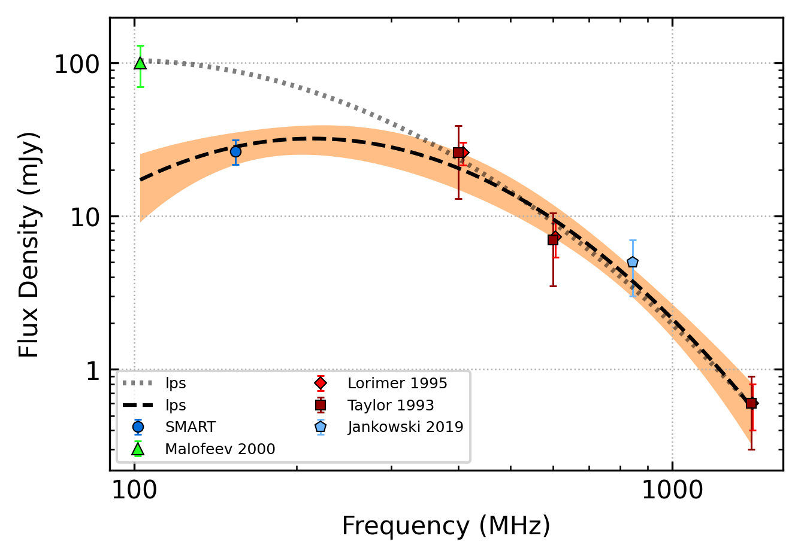

.. _J0944-1354:
J0944-1354
==========

Best Fit
--------

.. csv-table:: J0944-1354 fit results
   :header: "model","a","b","c","v0 (MHz)"

   "log_parabolic_spectrum","-1.75±0.59","-1.83±0.26","-1.62±0.09","379±3"

Fit Before MWA
--------------

.. csv-table:: J0944-1354 before fit results
   :header: "model","a","b","c","v0 (MHz)"

   "log_parabolic_spectrum","-1.66±0.50","-1.99±0.21","-1.58±0.09","379±3"

Flux Density Results
--------------------
.. csv-table:: J0944-1354 flux density total results
   :header: "N obs", "Flux Density (mJy)", "u_S_mean", "u_scint", "m_r_v"

   "1",  "26.5±21.1", "4.8", "20.5", "0.773"

.. csv-table:: J0944-1354 flux density individual results
   :header: "ObsID", "Flux Density (mJy)"

    "1267283936", "26.5±4.8"

Comparison Fit
--------------

Detection Plots
---------------

.. image:: detection_plots/1267283936_J0944-1354.prepfold.png
  :width: 800

.. image:: on_pulse_plots/1267283936_J0944-1354_1024_bins_gaussian_components.png
  :width: 800