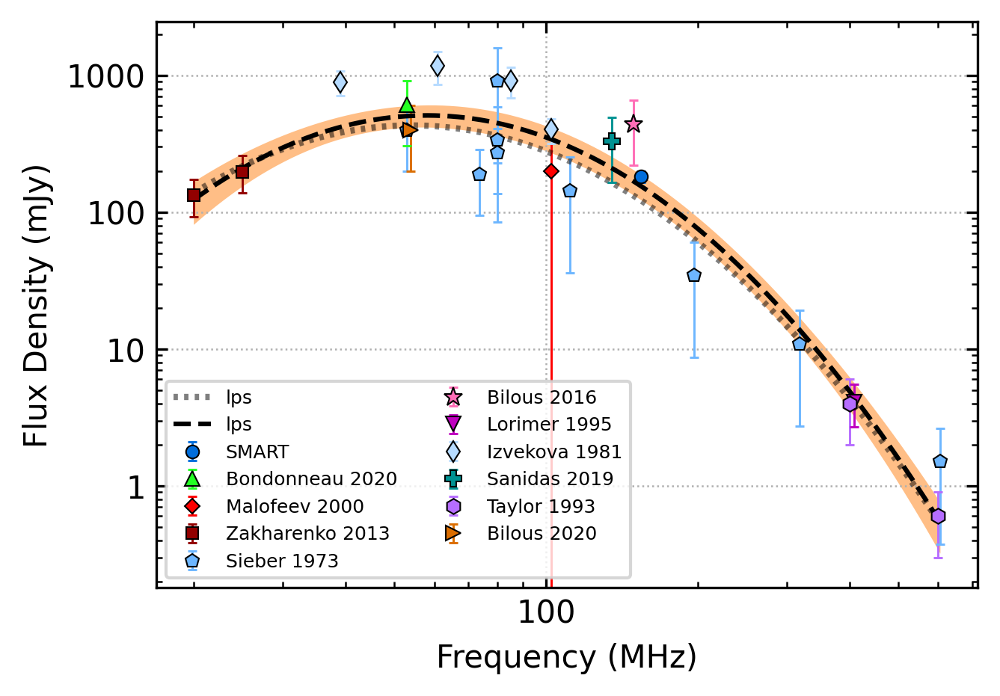

.. _J0946+0951:
J0946+0951
==========

Best Fit
--------

.. csv-table:: J0946+0951 fit results
   :header: "model","vc (MHz)","vpeak (MHz)","a","beta","c","v0 (MHz)"

   "double_turn_over_spectrum","8159±4377","51±2","-5.65±1.87","0.76±0.34","72.56±275.43","90±0"

Fit Before MWA
--------------

.. csv-table:: J0946+0951 before fit results
   :header: "model","vc (MHz)","vpeak (MHz)","a","beta","c","v0 (MHz)"

   "double_turn_over_spectrum","8159±4269","51±2","-5.66±1.88","0.76±0.34","73.49±280.86","90±0"

Flux Density Results
--------------------
.. csv-table:: J0946+0951 flux density total results
   :header: "N obs", "Flux Density (mJy)", "u_S_mean", "u_scint", "m_r_v"

   "1",  "181.9±129.0", "17.9", "127.8", "0.703"

.. csv-table:: J0946+0951 flux density individual results
   :header: "ObsID", "Flux Density (mJy)"

    "1267111608", "181.9±17.9"

Comparison Fit
--------------
.. image:: comparison_fits/J0946+0951_comparison_fit.png
  :width: 800

Detection Plots
---------------

.. image:: detection_plots/1267111608_J0946+0951.prepfold.png
  :width: 800

.. image:: on_pulse_plots/1267111608_J0946+0951_1024_bins_gaussian_components.png
  :width: 800