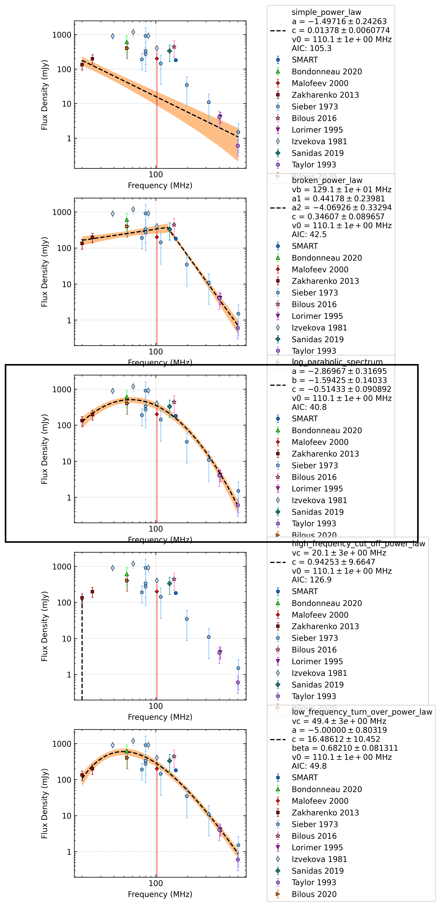

.. _J0946+0951:
J0946+0951
==========

Best Fit
--------
.. image:: best_fits/J0946+0951_low_frequency_turn_over_power_law_fit.png
  :width: 800

.. csv-table:: J0946+0951 fit results
   :header: "model","vc (MHz)","a","b","beta"

   "low_frequency_turn_over_power_law","48±2","-5.00±3.43","0.00±0.00","0.69±0.09"

Fit Before MWA
--------------
.. image:: before_mwa/J0946+0951_low_frequency_turn_over_power_law_fit.png
  :width: 800

.. csv-table:: J0946+0951 before fit results
   :header: "model","vc (MHz)","a","b","beta"

   "low_frequency_turn_over_power_law","48±2","-5.00±3.61","0.00±0.00","0.69±0.09"

Flux Density Results
--------------------
.. csv-table:: J0946+0951 flux density total results
   :header: "N obs", "Flux Density (mJy)", "u_S_mean", "u_scint", "m_r_v"

   "1",  "159.1±112.9", "15.6", "111.8", "0.703"

.. csv-table:: J0946+0951 flux density individual results
   :header: "ObsID", "Flux Density (mJy)"

    "1267111608", "159.1±15.6"

Comparison Fit
--------------

Detection Plots
---------------

.. image:: on_pulse_plots/1267111608_J0946+0951_1024_bins_gaussian_components.png
  :width: 800