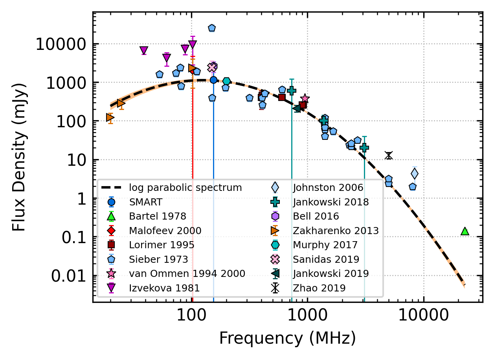
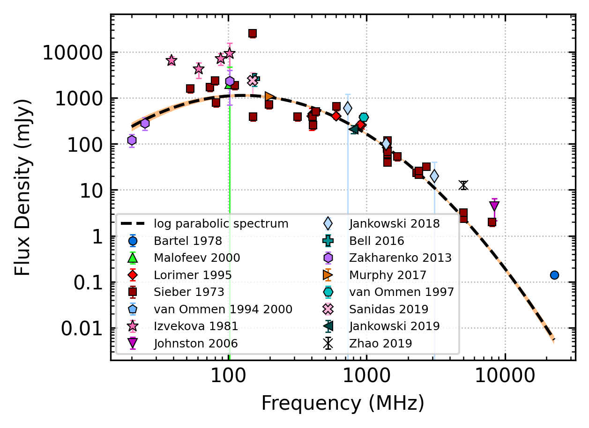

.. _J0953+0755:
J0953+0755
==========

Best Fit
--------

.. csv-table:: J0953+0755 fit results
   :header: "model","a","b","c"

   "log_parabolic_spectrum","-1.05±0.04","-2.12±0.03","-1.01±0.02"

Fit Before MWA
--------------

.. csv-table:: J0953+0755 before fit results
   :header: "model","a","b","c"

   "log_parabolic_spectrum","-1.05±0.04","-2.12±0.03","-1.01±0.02"

Flux Density Results
--------------------
.. csv-table:: J0953+0755 flux density total results
   :header: "N obs", "Flux Density (mJy)", "u_S_mean", "u_scint", "m_r_v"

   "2",  "1157.9±1161.4", "119.8", "1758.9", "1.519"

.. csv-table:: J0953+0755 flux density individual results
   :header: "ObsID", "Flux Density (mJy)"

    "1264867416", "1637.8±111.0"
    "1267111608", "678.1±44.9"
    "1268063336", "nan±nan"

Comparison Fit
--------------
.. image:: comparison_fits/J0953+0755_comparison_fit.png
  :width: 800

Detection Plots
---------------

.. image:: detection_plots/1264867416_J0953+0755.prepfold.png
  :width: 800

.. image:: on_pulse_plots/1264867416_J0953+0755_1024_bins_gaussian_components.png
  :width: 800
.. image:: detection_plots/1267111608_J0953+0755.prepfold.png
  :width: 800

.. image:: on_pulse_plots/1267111608_J0953+0755_1024_bins_gaussian_components.png
  :width: 800