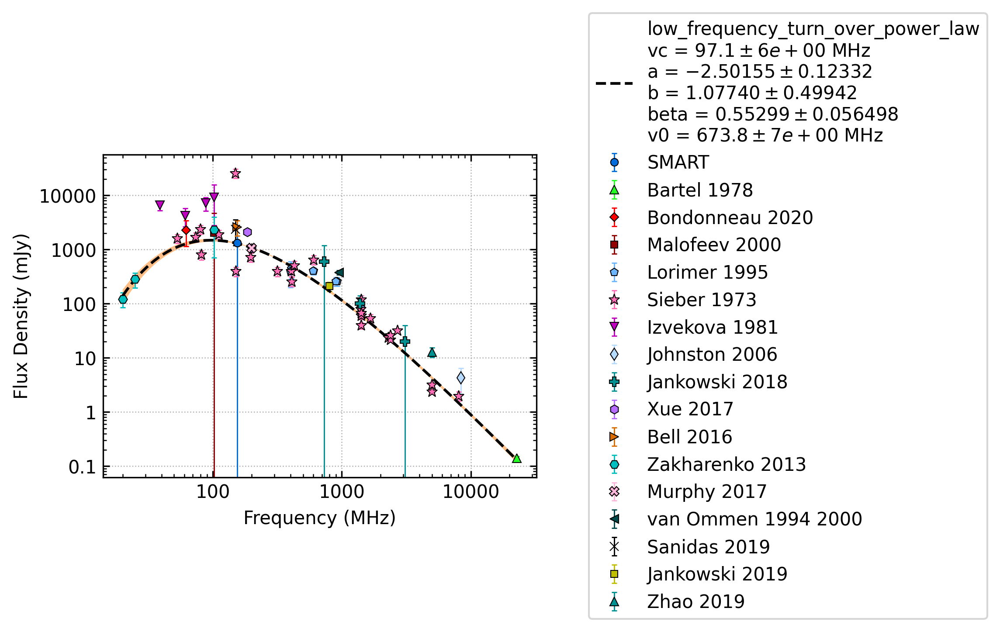
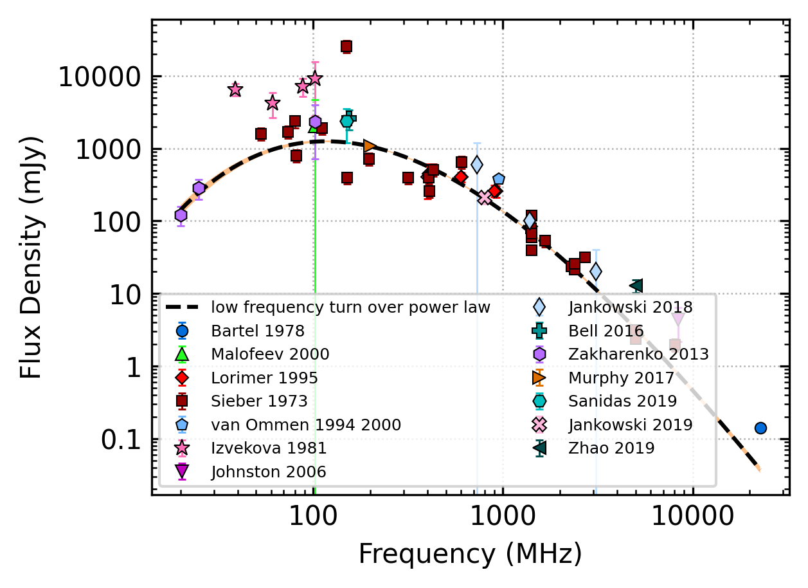

.. _J0953+0755:
J0953+0755
==========

Best Fit
--------

.. csv-table:: J0953+0755 fit results
   :header: "model","vc (MHz)","a","b","beta","v0 (MHz)"

   "low_frequency_turn_over_power_law","97±5","-2.50±0.12","1.08±0.50","0.55±0.06","673±6"

Fit Before MWA
--------------

.. csv-table:: J0953+0755 before fit results
   :header: "model","vc (MHz)","a","b","beta","v0 (MHz)"

   "low_frequency_turn_over_power_law","111±6","-3.62±0.05","100.00±50.00","0.33±0.01","673±6"

Flux Density Results
--------------------
.. csv-table:: J0953+0755 flux density total results
   :header: "N obs", "Flux Density (mJy)", "u_S_mean", "u_scint", "m_r_v"

   "2",  "1319.4±1322.9", "136.2", "2004.1", "1.519"

.. csv-table:: J0953+0755 flux density individual results
   :header: "ObsID", "Flux Density (mJy)"

    "1264867416", "1863.6±126.2"
    "1267111608", "775.2±51.2"
    "1268063336", "nan±nan"

Comparison Fit
--------------
.. image:: comparison_fits/J0953+0755_comparison_fit.png
  :width: 800

Detection Plots
---------------

.. image:: detection_plots/1264867416_J0953+0755.prepfold.png
  :width: 800

.. image:: on_pulse_plots/1264867416_J0953+0755_1024_bins_gaussian_components.png
  :width: 800
.. image:: detection_plots/1267111608_J0953+0755.prepfold.png
  :width: 800

.. image:: on_pulse_plots/1267111608_J0953+0755_1024_bins_gaussian_components.png
  :width: 800