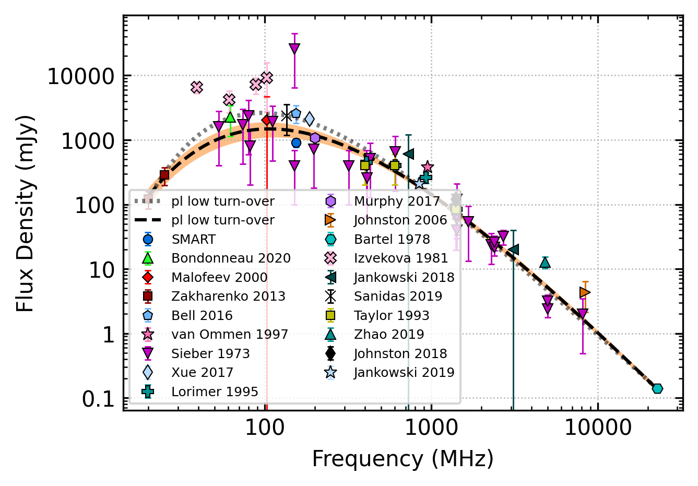

.. _J0953+0755:
J0953+0755
==========

Best Fit
--------

.. csv-table:: J0953+0755 fit results
   :header: "model","vpeak (MHz)","a","c","beta","v0 (MHz)"

   "low_frequency_turn_over_power_law","209±1","-2.27±0.08","0.43±0.07","2.10±0.10","673±6"

Fit Before MWA
--------------

.. csv-table:: J0953+0755 before fit results
   :header: "model","vpeak (MHz)","a","c","beta","v0 (MHz)"

   "low_frequency_turn_over_power_law","209±2","-2.28±0.08","0.43±0.07","2.10±0.09","673±6"

Flux Density Results
--------------------
.. csv-table:: J0953+0755 flux density total results
   :header: "N obs", "Flux Density (mJy)", "u_S_mean", "u_scint", "m_r_v"

   "3",  "906.4±788.2", "136.8", "1376.9", "1.519"

.. csv-table:: J0953+0755 flux density individual results
   :header: "ObsID", "Flux Density (mJy)"

    "1264867416", "1863.6±126.2"
    "1267111608", "775.2±51.2"
    "1268063336", "80.5±13.2"

Comparison Fit
--------------
.. image:: comparison_fits/J0953+0755_comparison_fit.png
  :width: 800

Detection Plots
---------------

.. image:: on_pulse_plots/1264867416_J0953+0755_1024_bins_gaussian_components.png
  :width: 800

.. image:: on_pulse_plots/1267111608_J0953+0755_1024_bins_gaussian_components.png
  :width: 800
.. image:: detection_plots/pf_1268063336_J0953+0755_09:53:09.30_+07:55:35.75_b1024_253.06ms_Cand.pfd.png
  :width: 800

.. image:: on_pulse_plots/1268063336_J0953+0755_256_bins_gaussian_components.png
  :width: 800