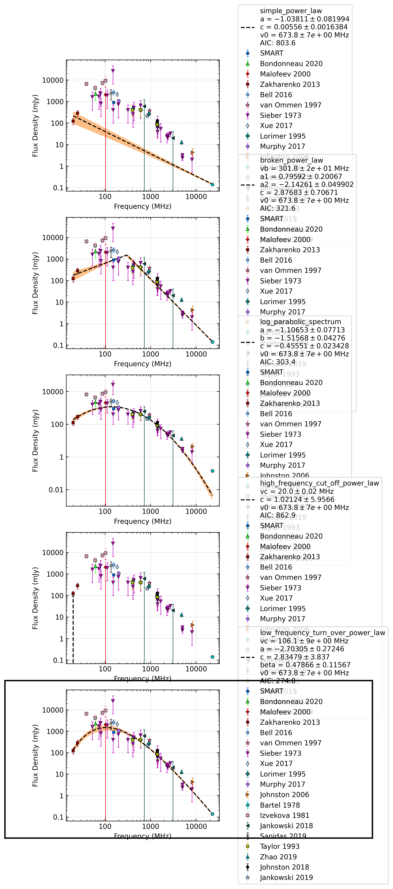

.. _J0953+0755:
J0953+0755
==========

Best Fit
--------
.. image:: best_fits/J0953+0755_low_frequency_turn_over_power_law_fit.png
  :width: 800

.. csv-table:: J0953+0755 fit results
   :header: "model","vc (MHz)","a","b","beta"

   "low_frequency_turn_over_power_law","111±4","-3.60±0.07","8.47±1.67","0.34±0.01"

Fit Before MWA
--------------
.. image:: before_mwa/J0953+0755_low_frequency_turn_over_power_law_fit.png
  :width: 800

.. csv-table:: J0953+0755 before fit results
   :header: "model","vc (MHz)","a","b","beta"

   "low_frequency_turn_over_power_law","112±4","-3.70±0.06","13.40±2.64","0.32±0.01"

Flux Density Results
--------------------
.. csv-table:: J0953+0755 flux density total results
   :header: "N obs", "Flux Density (mJy)", "u_S_mean", "u_scint", "m_r_v"

   "2",  "1319.4±1322.9", "136.2", "2004.1", "1.519"

.. csv-table:: J0953+0755 flux density individual results
   :header: "ObsID", "Flux Density (mJy)"

    "1264867416", "1863.6±126.2"
    "1267111608", "775.2±51.2"
    "1268063336", "nan±nan"

Comparison Fit
--------------

Detection Plots
---------------

.. image:: detection_plots/1264867416_J0953+0755.prepfold.png
  :width: 800

.. image:: on_pulse_plots/1264867416_J0953+0755_1024_bins_gaussian_components.png
  :width: 800
.. image:: detection_plots/1267111608_J0953+0755.prepfold.png
  :width: 800

.. image:: on_pulse_plots/1267111608_J0953+0755_1024_bins_gaussian_components.png
  :width: 800