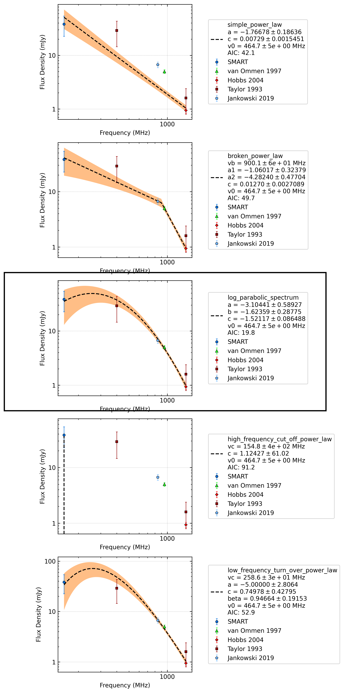

.. _J0955-5304:
J0955-5304
==========

Best Fit
--------
.. image:: best_fits/J0955-5304_log_parabolic_spectrum_fit.png
  :width: 800

.. csv-table:: J0955-5304 fit results
   :header: "model","a","b","c"

   "log_parabolic_spectrum","-2.90±0.54","-4.18±0.39","-2.88±0.04"

Fit Before MWA
--------------
.. image:: before_mwa/J0955-5304_simple_power_law_fit.png
  :width: 800

.. csv-table:: J0955-5304 before fit results
   :header: "model","a","b"

   "simple_power_law","-3.25±0.29","0.00±0.00"

Flux Density Results
--------------------
.. csv-table:: J0955-5304 flux density total results
   :header: "N obs", "Flux Density (mJy)", "u_S_mean", "u_scint", "m_r_v"

   "2",  "33.9±15.9", "13.8", "8.0", "0.235"

.. csv-table:: J0955-5304 flux density individual results
   :header: "ObsID", "Flux Density (mJy)"

    "1265983624", "24.7±7.5"
    "1266680784", "43.1±11.6"

Comparison Fit
--------------

Detection Plots
---------------

.. image:: on_pulse_plots/1265983624_J0955-5304_64_bins_gaussian_components.png
  :width: 800

.. image:: on_pulse_plots/1266680784_J0955-5304_100_bins_gaussian_components.png
  :width: 800