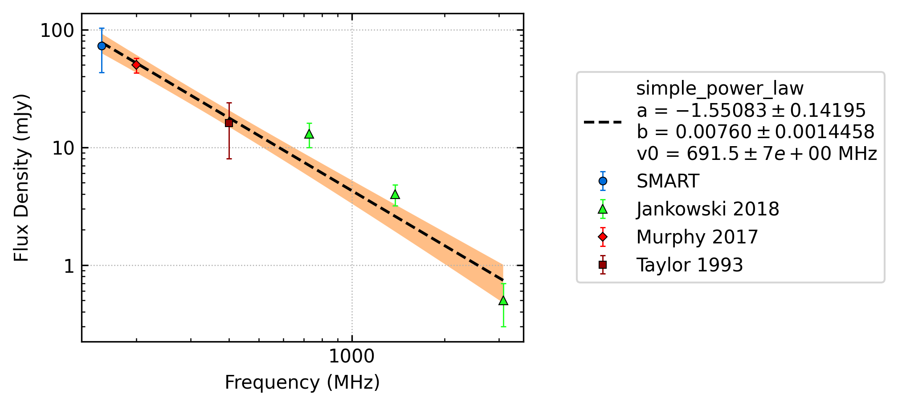
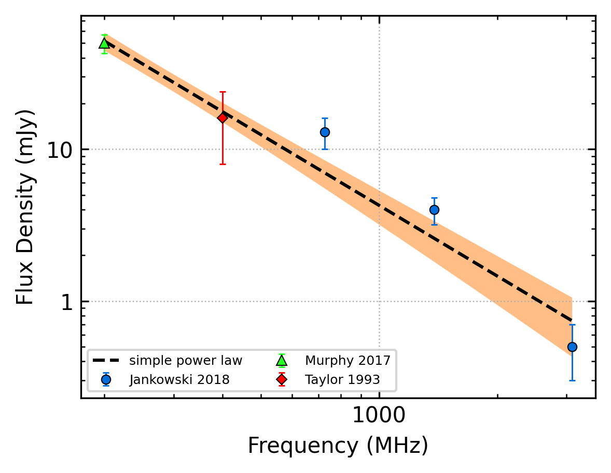
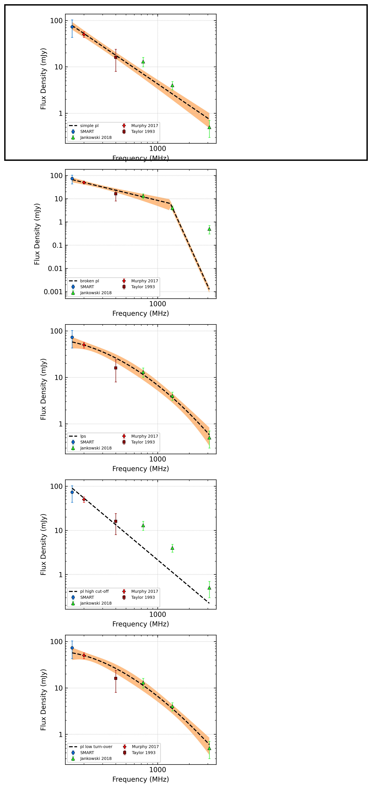
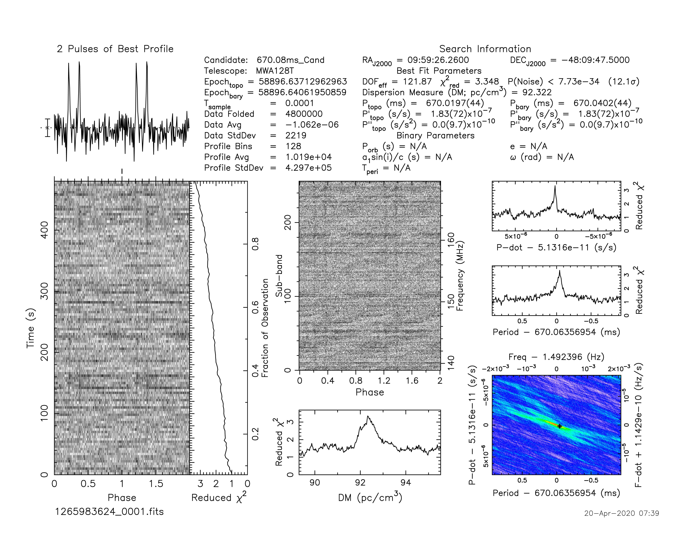
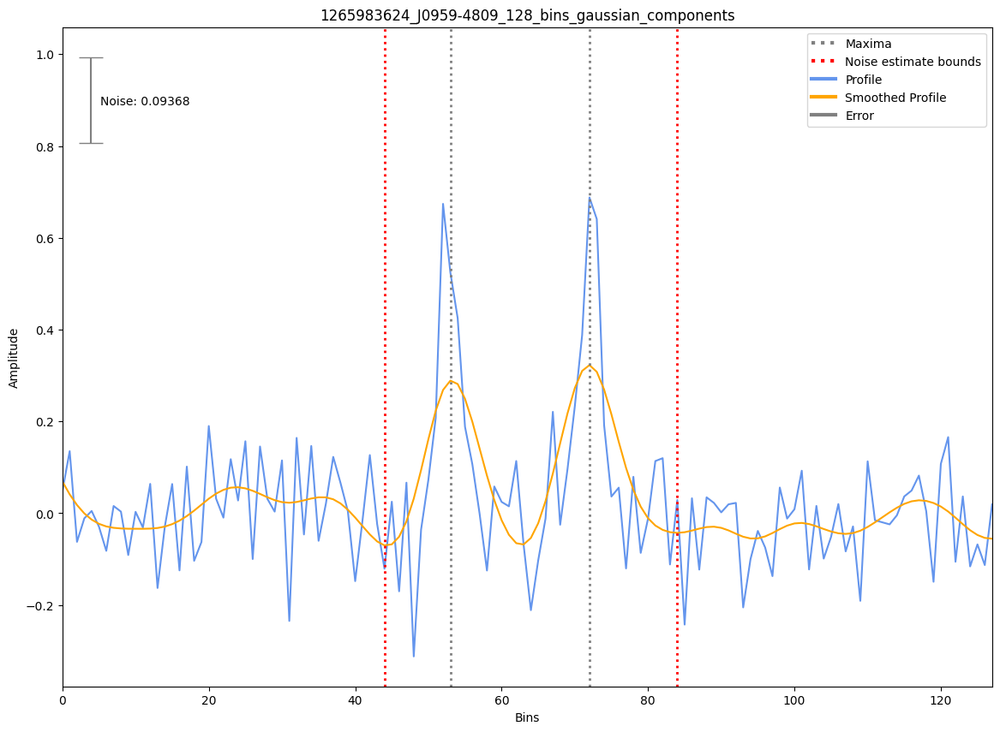
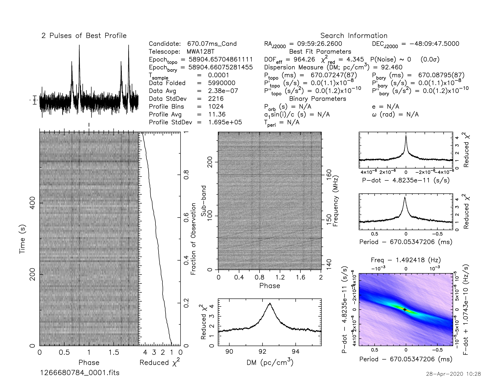
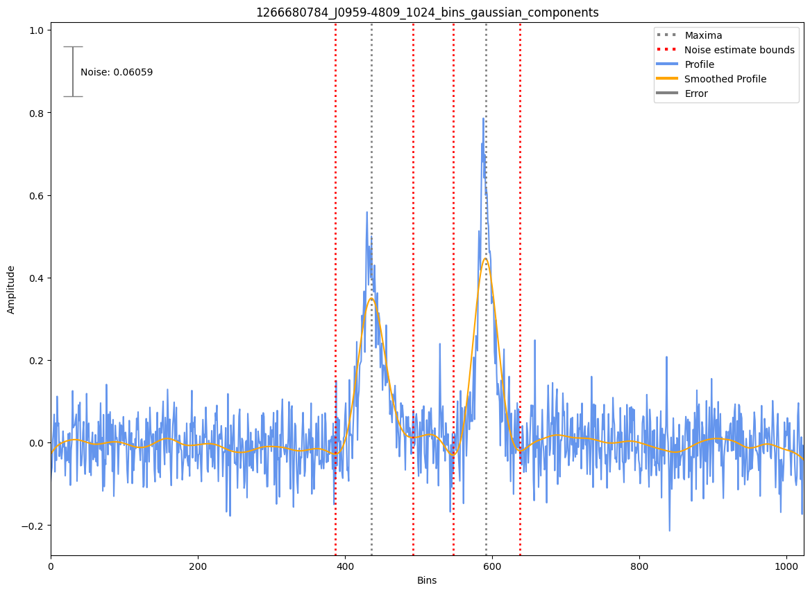

.. _J0959-4809:
J0959-4809
==========

Best Fit
--------

.. csv-table:: J0959-4809 fit results
   :header: "model","a","b","v0 (MHz)"

   "simple_power_law","-1.55±0.14","0.01±0.00","691±6"

Fit Before MWA
--------------

.. csv-table:: J0959-4809 before fit results
   :header: "model","a","b","v0 (MHz)"

   "simple_power_law","-1.55±0.15","0.01±0.00","787±7"

Flux Density Results
--------------------
.. csv-table:: J0959-4809 flux density total results
   :header: "N obs", "Flux Density (mJy)", "u_S_mean", "u_scint", "m_r_v"

   "2",  "73.1±30.0", "11.8", "22.0", "0.301"

.. csv-table:: J0959-4809 flux density individual results
   :header: "ObsID", "Flux Density (mJy)"

    "1265983624", "36.4±8.3"
    "1266680784", "109.7±8.4"

Comparison Fit
--------------

Detection Plots
---------------

