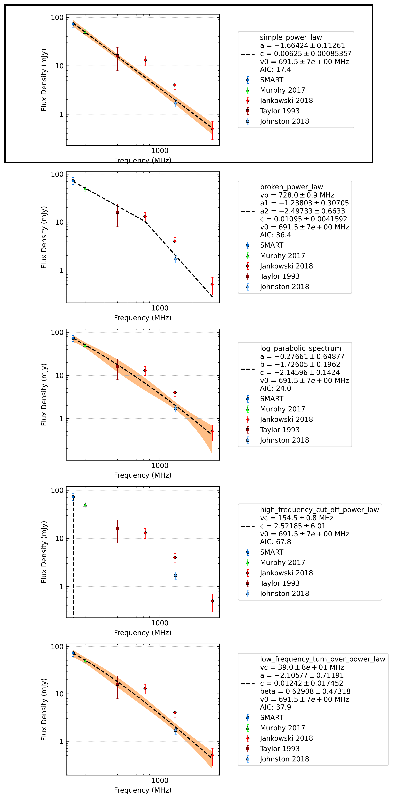

J0959-4809
==========

Best Fit
--------
.. image:: best_fits/J0959-4809_simple_power_law_fit.png
  :width: 800

.. csv-table:: J0959-4809 fit results
   :header: "model","a","b"

   "simple_power_law","-1.53±0.16","0.00±0.00"

Fit Before MWA
--------------
.. image:: before_mwa/J0959-4809_simple_power_law_fit.png
  :width: 800

.. csv-table:: J0959-4809 before fit results
   :header: "model","a","b"

   "simple_power_law","-1.55±0.16","0.00±0.00"

Flux Density Results
--------------------
.. csv-table:: J0959-4809 flux density total results
   :header: "N obs", "Flux Density (mJy)", "u_S_mean", "u_scint", "m_r_v"

   "2",  "64.6±26.3", "10.5", "19.5", "0.301"

.. csv-table:: J0959-4809 flux density individual results
   :header: "ObsID", "Flux Density (mJy)"

    "1265983624", "32.7±7.4"
    "1266680784", "96.5±7.4"

Comparison Fit
--------------

Detection Plots
---------------

.. image:: detection_plots/1265983624_J0959-4809.prepfold.png
  :width: 800

.. image:: on_pulse_plots/1265983624_J0959-4809_128_bins_gaussian_components.png
  :width: 800
.. image:: detection_plots/1266680784_J0959-4809.prepfold.png
  :width: 800

.. image:: on_pulse_plots/1266680784_J0959-4809_1024_bins_gaussian_components.png
  :width: 800