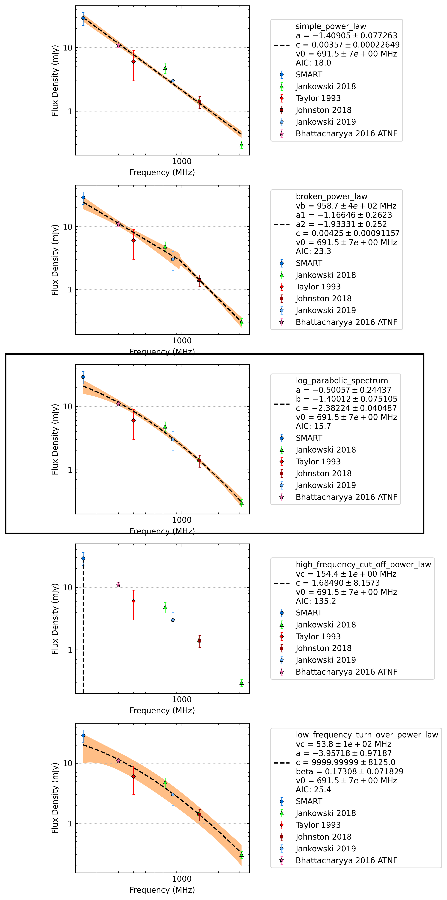

J1003-4747
==========

Best Fit
--------
.. image:: best_fits/J1003-4747_log_parabolic_spectrum_fit.png
  :width: 800

.. csv-table:: J1003-4747 fit results
   :header: "model","a","b","c"

   "log_parabolic_spectrum","-0.57±0.19","-1.69±0.10","-2.80±0.02"

Fit Before MWA
--------------
.. image:: before_mwa/J1003-4747_simple_power_law_fit.png
  :width: 800

.. csv-table:: J1003-4747 before fit results
   :header: "model","a","b"

   "simple_power_law","-1.41±0.09","0.00±0.00"

Flux Density Results
--------------------
.. csv-table:: J1003-4747 flux density total results
   :header: "N obs", "Flux Density (mJy)", " u_S_mean", "u_scint", "m_r_v"

   "1",  "25.5±9.5", "5.9", "7.5", "0.293"

.. csv-table:: J1003-4747 flux density individual results
   :header: "ObsID", "Flux Density (mJy)"

    "1266680784", "25.5±5.9"

Comparison Fit
--------------

Detection Plots
---------------

.. image:: detection_plots/1266680784_J1003-4747.prepfold.png
  :width: 800

.. image:: on_pulse_plots/1266680784_J1003-4747_128_bins_gaussian_components.png
  :width: 800