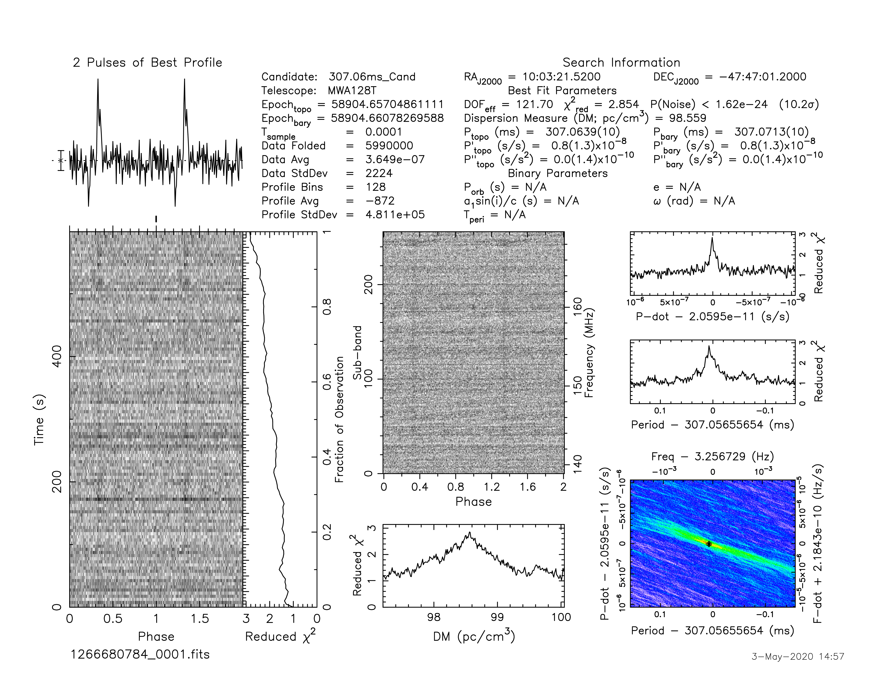

.. _J1003-4747:
J1003-4747
==========

Best Fit
--------

.. csv-table:: J1003-4747 fit results
   :header: "model","a","b","c","v0 (MHz)"

   "log_parabolic_spectrum","-0.56±0.26","-1.38±0.08","-2.38±0.04","691±6"

Fit Before MWA
--------------

.. csv-table:: J1003-4747 before fit results
   :header: "model","a","b","v0 (MHz)"

   "simple_power_law","-1.41±0.09","0.00±0.00","964±9"

Flux Density Results
--------------------
.. csv-table:: J1003-4747 flux density total results
   :header: "N obs", "Flux Density (mJy)", "u_S_mean", "u_scint", "m_r_v"

   "1",  "29.0±10.8", "6.7", "8.5", "0.293"

.. csv-table:: J1003-4747 flux density individual results
   :header: "ObsID", "Flux Density (mJy)"

    "1266680784", "29.0±6.7"

Comparison Fit
--------------
.. image:: comparison_fits/J1003-4747_comparison_fit.png
  :width: 800

Detection Plots
---------------

.. image:: on_pulse_plots/1266680784_J1003-4747_128_bins_gaussian_components.png
  :width: 800