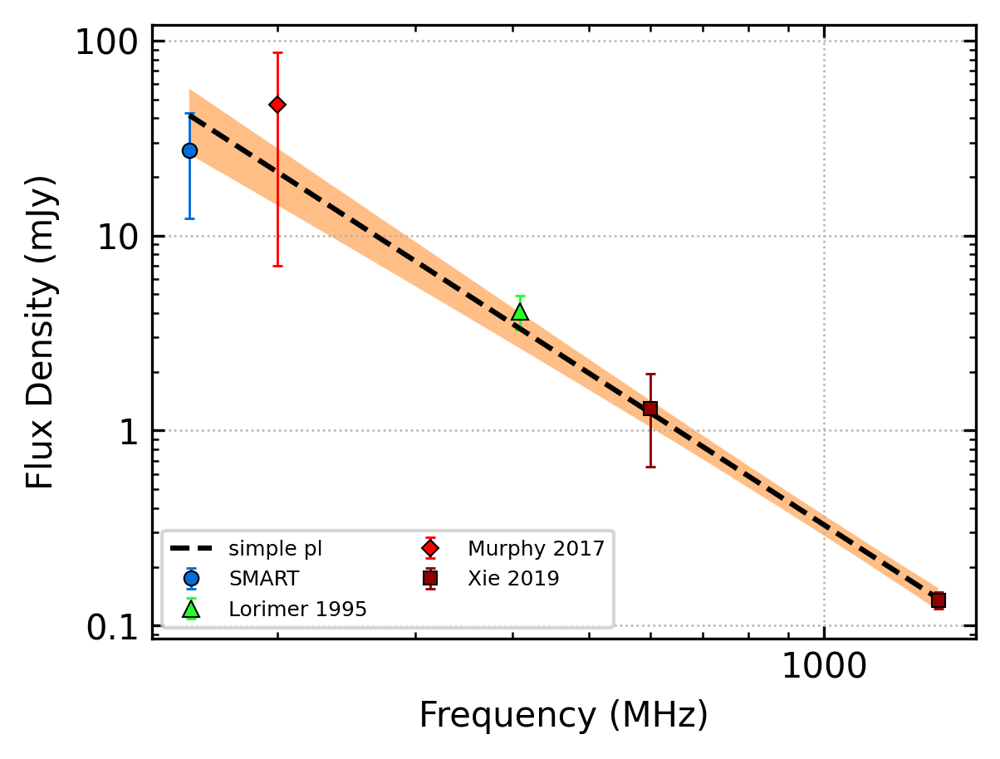
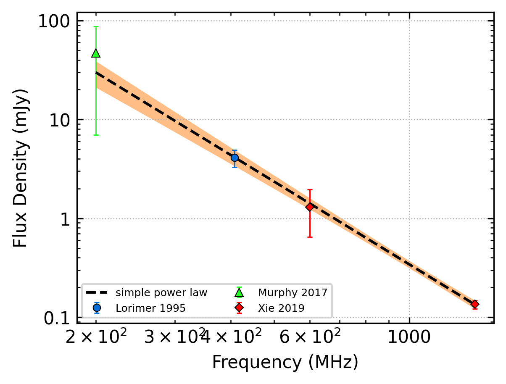
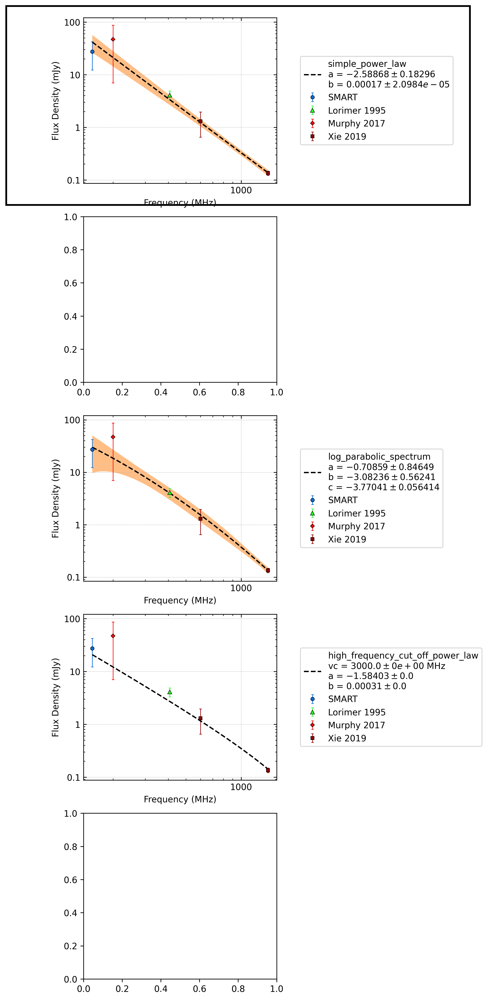
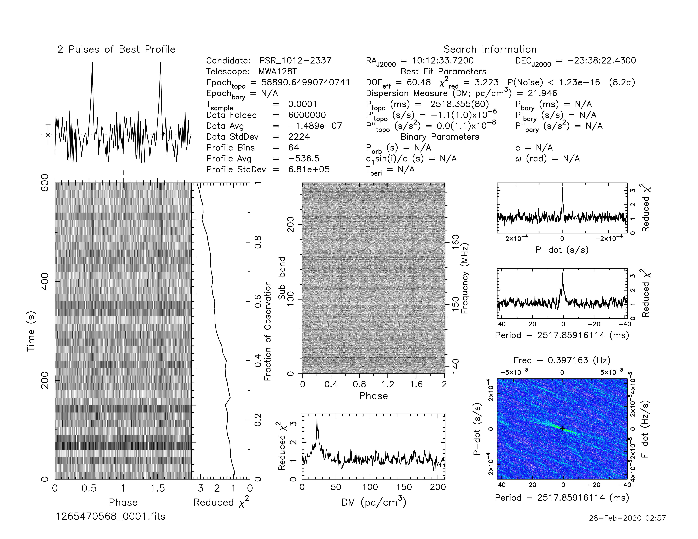
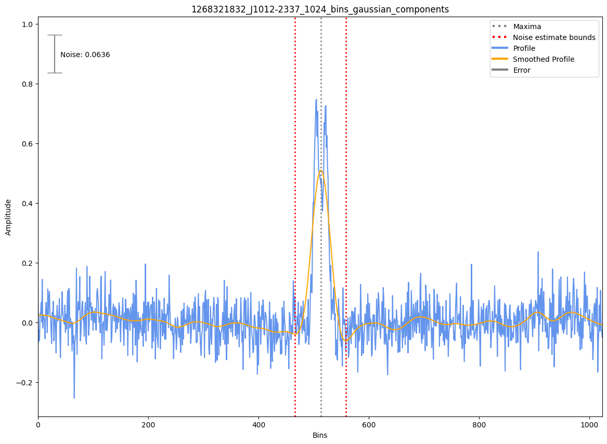

.. _J1012-2337:
J1012-2337
==========

Best Fit
--------

.. csv-table:: J1012-2337 fit results
   :header: "model","a","b"

   "simple_power_law","-2.54±0.20","0.00±0.00"

Fit Before MWA
--------------

.. csv-table:: J1012-2337 before fit results
   :header: "model","a","b"

   "simple_power_law","-2.78±0.17","0.00±0.00"

Flux Density Results
--------------------
.. csv-table:: J1012-2337 flux density total results
   :header: "N obs", "Flux Density (mJy)", "u_S_mean", "u_scint", "m_r_v"

   "2",  "23.7±13.0", "7.2", "13.9", "0.586"

.. csv-table:: J1012-2337 flux density individual results
   :header: "ObsID", "Flux Density (mJy)"

    "1265470568", "14.1±5.8"
    "1268321832", "33.4±4.3"

Comparison Fit
--------------

Detection Plots
---------------

.. image:: on_pulse_plots/1265470568_J1012-2337_64_bins_gaussian_components.png
  :width: 800
.. image:: detection_plots/1268321832_J1012-2337.prepfold.png
  :width: 800

