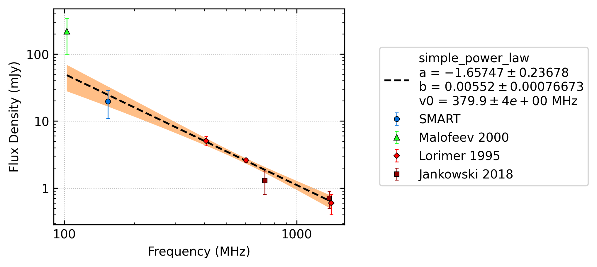
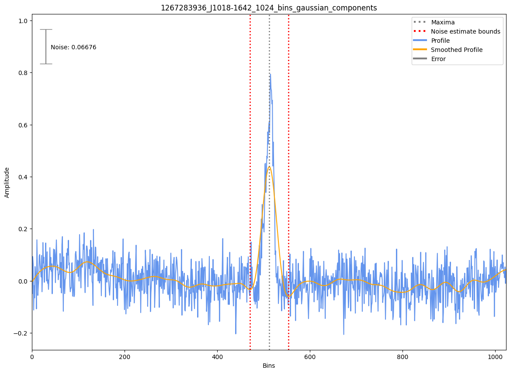
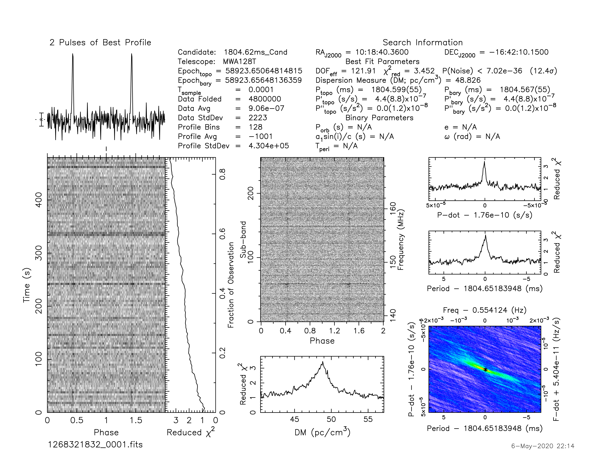
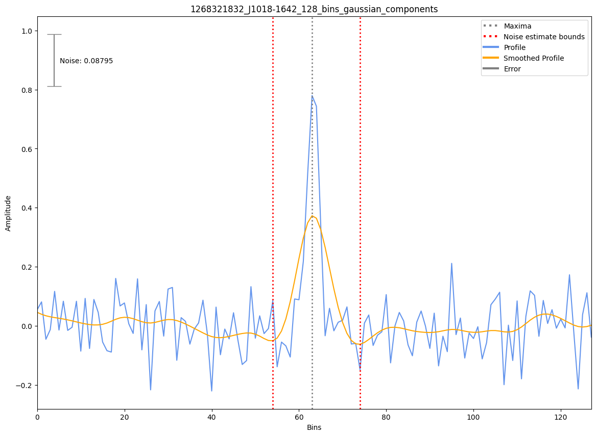

.. _J1018-1642:
J1018-1642
==========

Best Fit
--------

.. csv-table:: J1018-1642 fit results
   :header: "model","a","b","v0 (MHz)"

   "simple_power_law","-1.66±0.24","0.01±0.00","379±3"

Fit Before MWA
--------------
.. image:: before_mwa/J1018-1642_simple_power_law_fit.png
  :width: 800

.. csv-table:: J1018-1642 before fit results
   :header: "model","a","b","v0 (MHz)"

   "simple_power_law","-1.78±0.35","0.01±0.00","379±3"

Flux Density Results
--------------------
.. csv-table:: J1018-1642 flux density total results
   :header: "N obs", "Flux Density (mJy)", "u_S_mean", "u_scint", "m_r_v"

   "2",  "19.8±8.9", "6.8", "8.1", "0.407"

.. csv-table:: J1018-1642 flux density individual results
   :header: "ObsID", "Flux Density (mJy)"

    "1267283936", "23.5±4.2"
    "1268321832", "16.1±5.4"

Comparison Fit
--------------
.. image:: comparison_fits/J1018-1642_comparison_fit.png
  :width: 800

Detection Plots
---------------

.. image:: detection_plots/1267283936_J1018-1642.prepfold.png
  :width: 800

