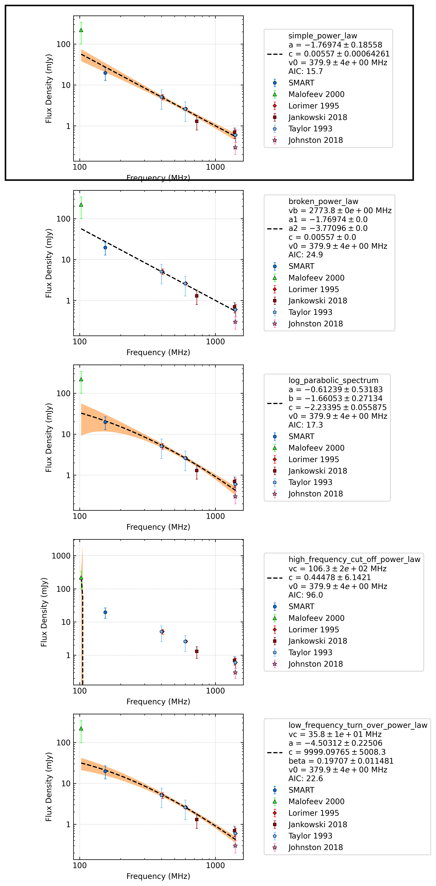

.. _J1018-1642:
J1018-1642
==========

Best Fit
--------
.. image:: best_fits/J1018-1642_simple_power_law_fit.png
  :width: 800

.. csv-table:: J1018-1642 fit results
   :header: "model","a","b"

   "simple_power_law","-1.60±0.18","0.00±0.00"

Fit Before MWA
--------------
.. image:: before_mwa/J1018-1642_simple_power_law_fit.png
  :width: 800

.. csv-table:: J1018-1642 before fit results
   :header: "model","a","b"

   "simple_power_law","-1.74±0.25","0.00±0.00"

Flux Density Results
--------------------
.. csv-table:: J1018-1642 flux density total results
   :header: "N obs", "Flux Density (mJy)", "u_S_mean", "u_scint", "m_r_v"

   "2",  "17.2±7.7", "5.9", "7.0", "0.407"

.. csv-table:: J1018-1642 flux density individual results
   :header: "ObsID", "Flux Density (mJy)"

    "1267283936", "20.6±3.7"
    "1268321832", "13.8±4.7"

Comparison Fit
--------------

Detection Plots
---------------

.. image:: detection_plots/1267283936_J1018-1642.prepfold.png
  :width: 800

.. image:: on_pulse_plots/1267283936_J1018-1642_1024_bins_gaussian_components.png
  :width: 800

.. image:: on_pulse_plots/1268321832_J1018-1642_128_bins_gaussian_components.png
  :width: 800