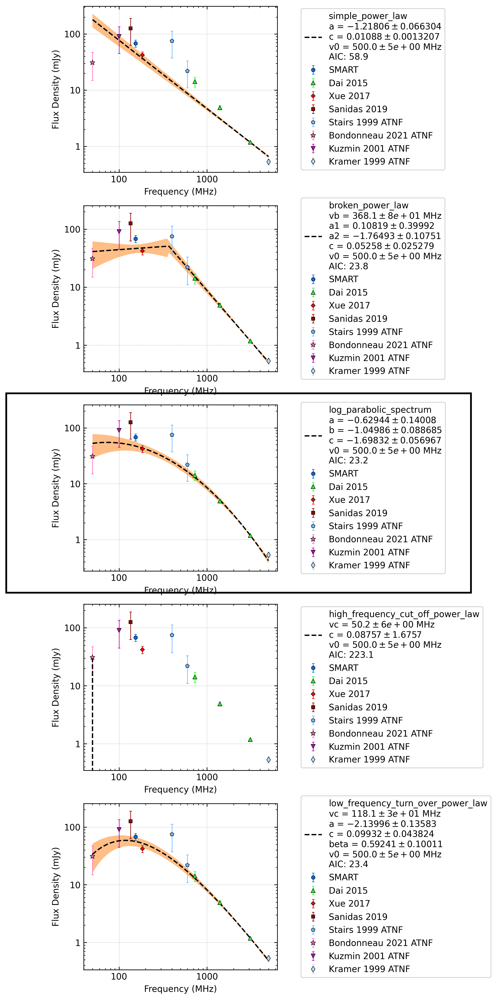

J1022+1001
==========

Best Fit
--------
.. image:: best_fits/J1022+1001_log_parabolic_spectrum_fit.png
  :width: 800

.. csv-table:: J1022+1001 fit results
   :header: "model","a","b","c"

   "log_parabolic_spectrum","-0.40±0.13","-1.61±0.07","-2.26±0.03"

Fit Before MWA
--------------
.. image:: before_mwa/J1022+1001_log_parabolic_spectrum_fit.png
  :width: 800

.. csv-table:: J1022+1001 before fit results
   :header: "model","a","b","c"

   "log_parabolic_spectrum","-0.38±0.14","-1.62±0.07","-2.26±0.03"

Flux Density Results
--------------------
.. csv-table:: J1022+1001 flux density total results
   :header: "N obs", "Flux Density (mJy)", " u_S_mean", "u_scint", "m_r_v"

   "1",  "59.8±51.4", "8.4", "50.7", "0.848"

.. csv-table:: J1022+1001 flux density individual results
   :header: "ObsID", "Flux Density (mJy)"

    "1264867416", "59.8±8.4"

Comparison Fit
--------------

Detection Plots
---------------

.. image:: on_pulse_plots/1264867416_J1022+1001_165_bins_gaussian_components.png
  :width: 800