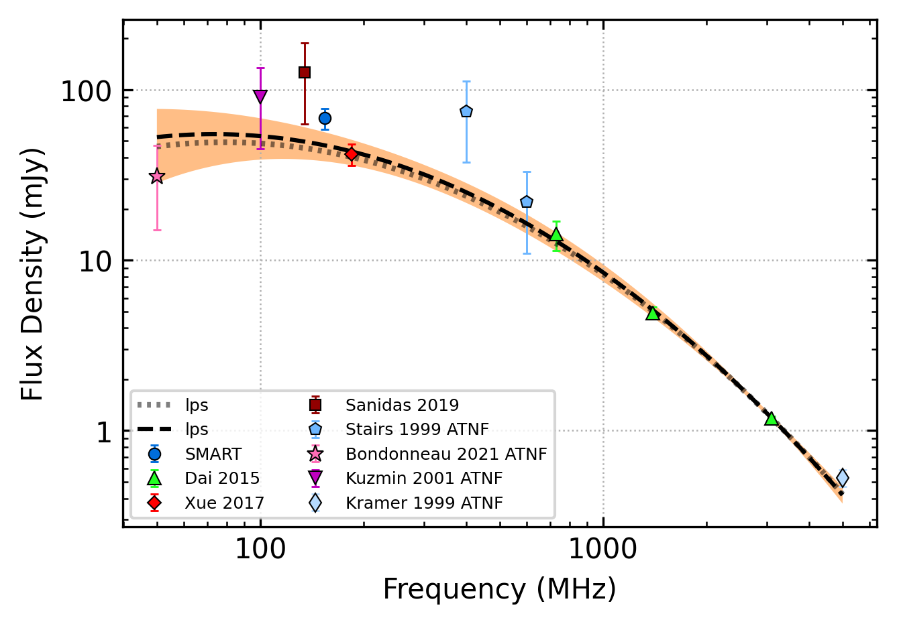

.. _J1022+1001:
J1022+1001
==========

Best Fit
--------

.. csv-table:: J1022+1001 fit results
   :header: "model","vc (MHz)","vpeak (MHz)","a","beta","c","v0 (MHz)"

   "double_turn_over_spectrum","96999±89826","109±17","-2.20±0.11","0.47±0.04","0.18±0.06","492±4"

Fit Before MWA
--------------

.. csv-table:: J1022+1001 before fit results
   :header: "model","vb (MHz)","a1","a2","c","v0 (MHz)"

   "broken_power_law","391±96","0.09±0.44","-1.77±0.08","0.05±0.02","492±4"

Flux Density Results
--------------------
.. csv-table:: J1022+1001 flux density total results
   :header: "N obs", "Flux Density (mJy)", "u_S_mean", "u_scint", "m_r_v"

   "1",  "68.0±58.5", "9.6", "57.7", "0.849"

.. csv-table:: J1022+1001 flux density individual results
   :header: "ObsID", "Flux Density (mJy)"

    "1264867416", "68.0±9.6"

Comparison Fit
--------------
.. image:: comparison_fits/J1022+1001_comparison_fit.png
  :width: 800

Detection Plots
---------------

.. image:: detection_plots/1264867416_J1022+1001.prepfold.png
  :width: 800

.. image:: on_pulse_plots/1264867416_J1022+1001_165_bins_gaussian_components.png
  :width: 800