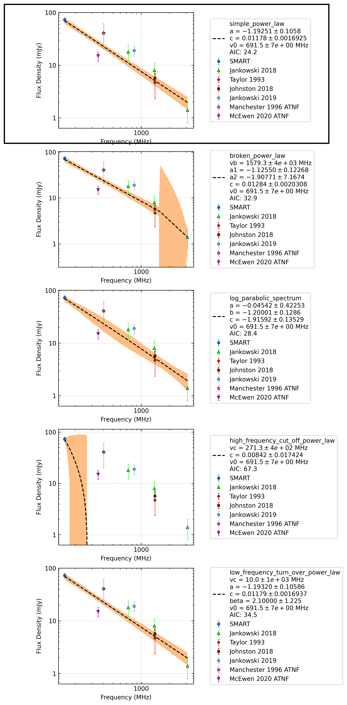

.. _J1034-3224:
J1034-3224
==========

Best Fit
--------
.. image:: best_fits/J1034-3224_log_parabolic_spectrum_fit.png
  :width: 800

.. csv-table:: J1034-3224 fit results
   :header: "model","a","b","c","v0 (MHz)"

   "log_parabolic_spectrum","-2.13±0.84","-0.38±0.30","-1.73±0.10","691±6"

Fit Before MWA
--------------
.. image:: before_mwa/J1034-3224_log_parabolic_spectrum_fit.png
  :width: 800

.. csv-table:: J1034-3224 before fit results
   :header: "model","a","b","c","v0 (MHz)"

   "log_parabolic_spectrum","-2.19±0.82","-1.14±0.31","-1.85±0.11","1041±10"

Flux Density Results
--------------------
.. csv-table:: J1034-3224 flux density total results
   :header: "N obs", "Flux Density (mJy)", "u_S_mean", "u_scint", "m_r_v"

   "1",  "73.0±30.0", "6.8", "29.2", "0.400"

.. csv-table:: J1034-3224 flux density individual results
   :header: "ObsID", "Flux Density (mJy)"

    "1268321832", "73.0±6.8"

Comparison Fit
--------------

Detection Plots
---------------

.. image:: detection_plots/1268321832_J1034-3224.prepfold.png
  :width: 800

.. image:: on_pulse_plots/1268321832_J1034-3224_512_bins_gaussian_components.png
  :width: 800