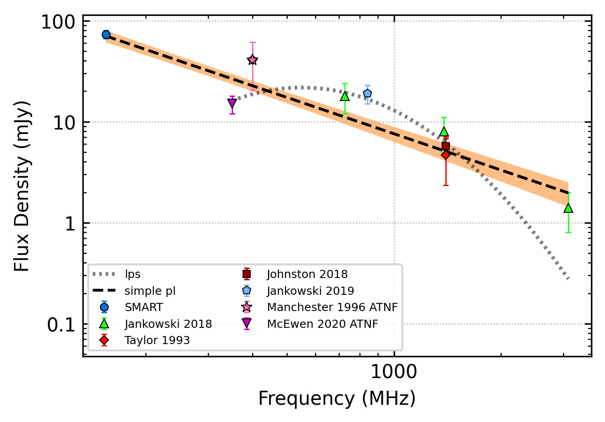

.. _J1034-3224:
J1034-3224
==========

Best Fit
--------

.. csv-table:: J1034-3224 fit results
   :header: "model","vc (MHz)","a","c","v0 (MHz)"

   "high_frequency_cut_off_power_law","3944±942","-0.54±0.18","0.01±0.00","676±6"

Fit Before MWA
--------------

.. csv-table:: J1034-3224 before fit results
   :header: "model","vc (MHz)","a","c","v0 (MHz)"

   "high_frequency_cut_off_power_law","3906±885","-0.52±0.18","0.01±0.00","676±6"

Flux Density Results
--------------------
.. csv-table:: J1034-3224 flux density total results
   :header: "N obs", "Flux Density (mJy)", "u_S_mean", "u_scint", "m_r_v"

   "1",  "73.0±30.0", "6.8", "29.2", "0.400"

.. csv-table:: J1034-3224 flux density individual results
   :header: "ObsID", "Flux Density (mJy)"

    "1268321832", "73.0±6.8"

Comparison Fit
--------------
.. image:: comparison_fits/J1034-3224_comparison_fit.png
  :width: 800

Detection Plots
---------------

.. image:: on_pulse_plots/1268321832_J1034-3224_512_bins_gaussian_components.png
  :width: 800