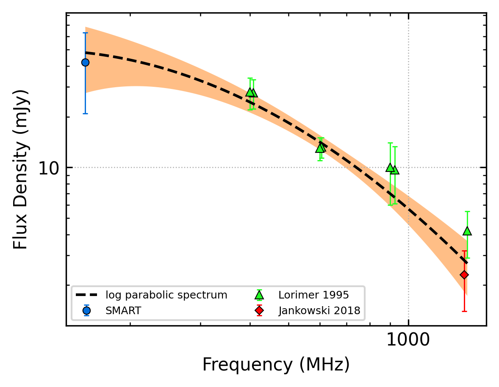
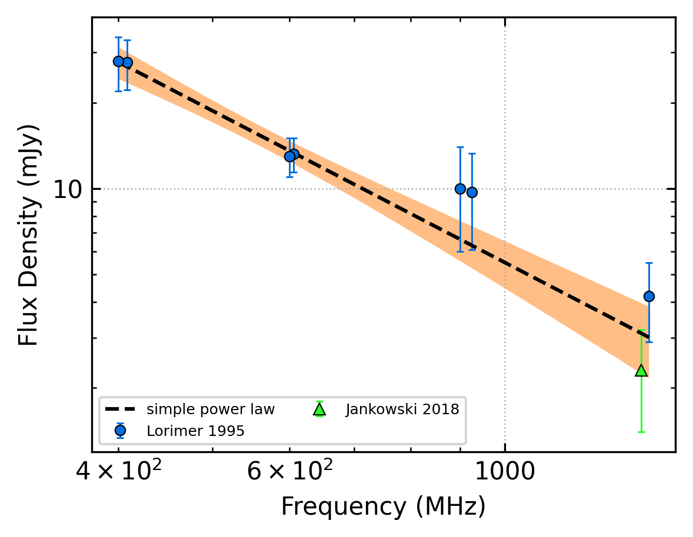

J1041-1942
==========

Best Fit
--------

.. csv-table:: J1041-1942 fit results
   :header: "model","a","b","c"

   "log_parabolic_spectrum","-1.08±0.60","-2.27±0.58","-2.49±0.14"

Fit Before MWA
--------------

.. csv-table:: J1041-1942 before fit results
   :header: "model","a","b"

   "simple_power_law","-1.77±0.29","0.00±0.00"

Flux Density Results
--------------------
.. csv-table:: J1041-1942 flux density total results
   :header: "N obs", "Flux Density (mJy)", " u_S_mean", "u_scint", "m_r_v"

   "1",  "42.0±21.1", "5.8", "20.3", "0.484"

.. csv-table:: J1041-1942 flux density individual results
   :header: "ObsID", "Flux Density (mJy)"

    "1268321832", "42.0±5.8"

Comparison Fit
--------------
.. image:: comparison_fits/J1041-1942_comparison_fit.png
  :width: 800

Detection Plots
---------------

.. image:: detection_plots/1268321832_J1041-1942.prepfold.png
  :width: 800

.. image:: on_pulse_plots/1268321832_J1041-1942_512_bins_gaussian_components.png
  :width: 800