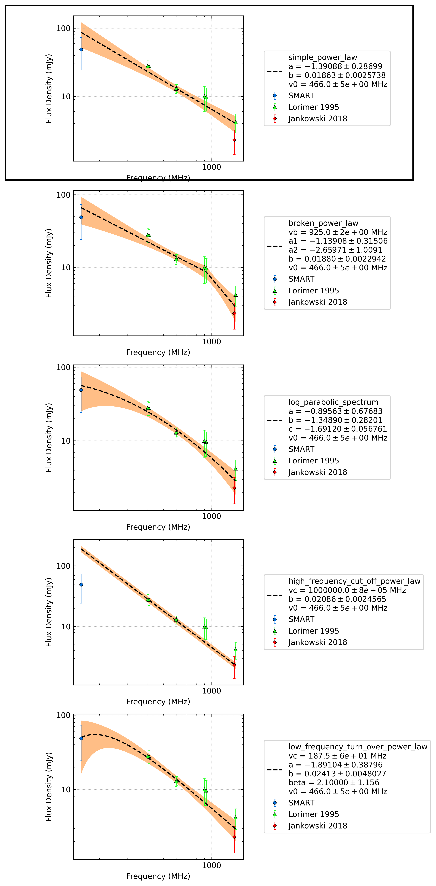
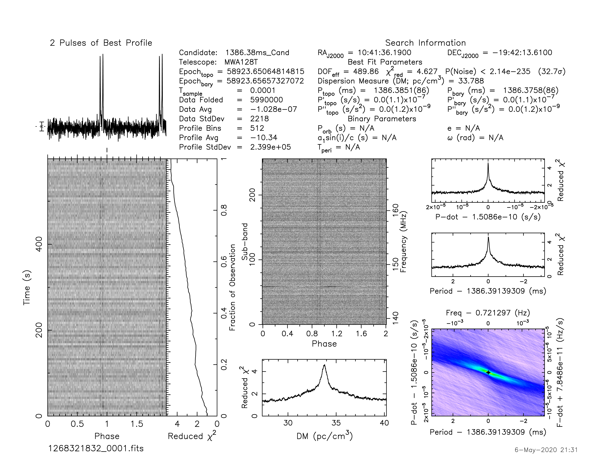

.. _J1041-1942:
J1041-1942
==========

Best Fit
--------
.. image:: best_fits/J1041-1942_i_fit.png
  :width: 800

.. csv-table:: J1041-1942 fit results
   :header: "model","a","b","v0 (MHz)"

   "i","-1.39±0.29","0.02±0.00","466±4"

Fit Before MWA
--------------

.. csv-table:: J1041-1942 before fit results
   :header: "model","a","b","v0 (MHz)"

   "i","-1.76±0.31","0.01±0.00","750±7"

Flux Density Results
--------------------
.. csv-table:: J1041-1942 flux density total results
   :header: "N obs", "Flux Density (mJy)", "u_S_mean", "u_scint", "m_r_v"

   "1",  "49.0±24.7", "6.7", "23.7", "0.484"

.. csv-table:: J1041-1942 flux density individual results
   :header: "ObsID", "Flux Density (mJy)"

    "1268321832", "49.0±6.7"

Comparison Fit
--------------

Detection Plots
---------------

.. image:: on_pulse_plots/1268321832_J1041-1942_512_bins_gaussian_components.png
  :width: 800