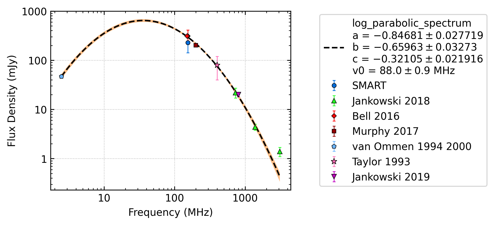
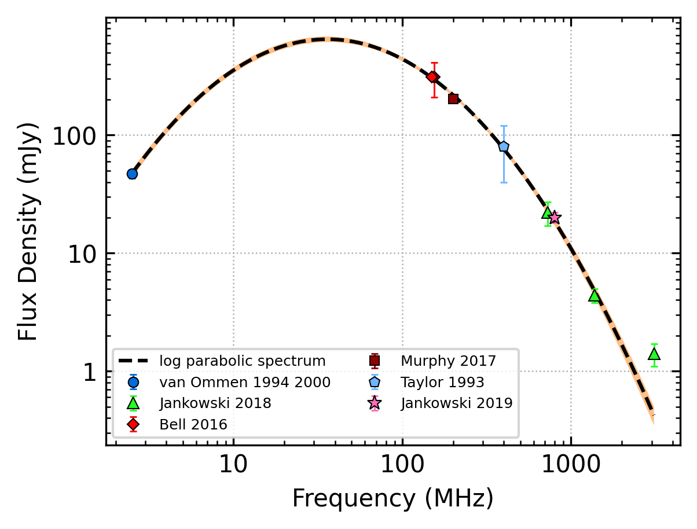

J1057-5226
==========

Best Fit
--------

.. csv-table:: J1057-5226 fit results
   :header: "model","a","b","c"

   "log_parabolic_spectrum","-0.85±0.02","-2.65±0.07","-2.25±0.05"

Fit Before MWA
--------------

.. csv-table:: J1057-5226 before fit results
   :header: "model","a","b","c"

   "log_parabolic_spectrum","-0.85±0.02","-2.65±0.08","-2.25±0.05"

Flux Density Results
--------------------
.. csv-table:: J1057-5226 flux density total results
   :header: "N obs", "Flux Density (mJy)", " u_S_mean", "u_scint", "m_r_v"

   "2",  "198.3±73.9", "15.5", "102.1", "0.515"

.. csv-table:: J1057-5226 flux density individual results
   :header: "ObsID", "Flux Density (mJy)"

    "1266680784", "148.3±8.2"
    "1267459328", "248.3±13.2"

Comparison Fit
--------------
.. image:: comparison_fits/J1057-5226_comparison_fit.png
  :width: 800

Detection Plots
---------------

.. image:: detection_plots/1266680784_J1057-5226.prepfold.png
  :width: 800

.. image:: on_pulse_plots/1266680784_J1057-5226_1024_bins_gaussian_components.png
  :width: 800
.. image:: detection_plots/1267459328_J1057-5226.prepfold.png
  :width: 800

.. image:: on_pulse_plots/1267459328_J1057-5226_1024_bins_gaussian_components.png
  :width: 800