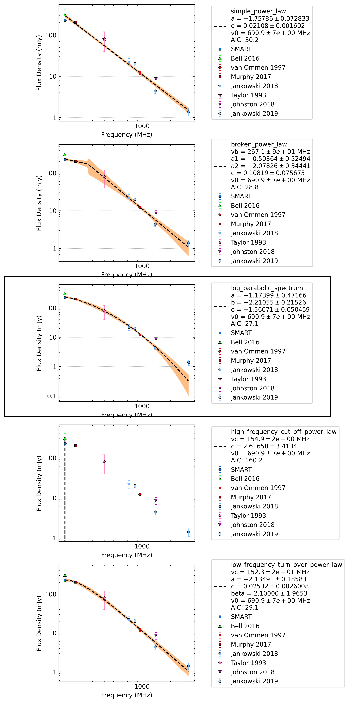

.. _J1057-5226:
J1057-5226
==========

Best Fit
--------
.. image:: best_fits/J1057-5226_low_frequency_turn_over_power_law_fit.png
  :width: 800

.. csv-table:: J1057-5226 fit results
   :header: "model","vc (MHz)","a","b","beta"

   "low_frequency_turn_over_power_law","26±0","-3.72±0.19","2.51±1.13","0.24±0.01"

Fit Before MWA
--------------
.. image:: before_mwa/J1057-5226_low_frequency_turn_over_power_law_fit.png
  :width: 800

.. csv-table:: J1057-5226 before fit results
   :header: "model","vc (MHz)","a","b","beta"

   "low_frequency_turn_over_power_law","25±1","-3.26±0.44","0.25±0.46","0.29±0.05"

Flux Density Results
--------------------
.. csv-table:: J1057-5226 flux density total results
   :header: "N obs", "Flux Density (mJy)", "u_S_mean", "u_scint", "m_r_v"

   "2",  "227.7±85.3", "17.8", "117.2", "0.515"

.. csv-table:: J1057-5226 flux density individual results
   :header: "ObsID", "Flux Density (mJy)"

    "1266680784", "168.6±9.4"
    "1267459328", "286.7±15.2"

Comparison Fit
--------------

Detection Plots
---------------

.. image:: on_pulse_plots/1266680784_J1057-5226_1024_bins_gaussian_components.png
  :width: 800

.. image:: on_pulse_plots/1267459328_J1057-5226_1024_bins_gaussian_components.png
  :width: 800