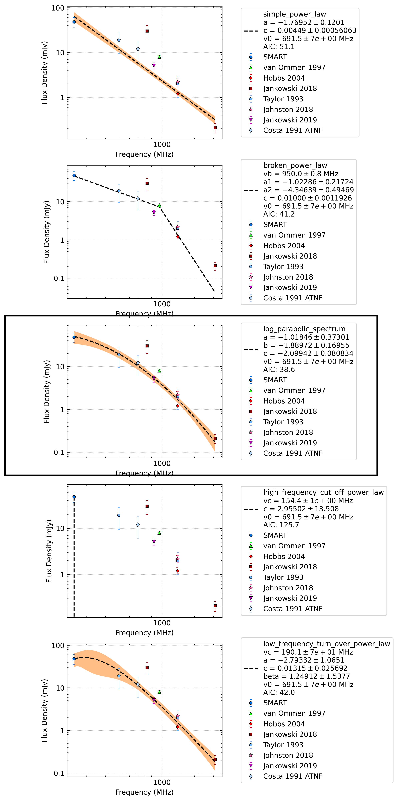

J1059-5742
==========

Best Fit
--------
.. image:: best_fits/J1059-5742_log_parabolic_spectrum_fit.png
  :width: 800

.. csv-table:: J1059-5742 fit results
   :header: "model","a","b","c"

   "log_parabolic_spectrum","-0.98±0.49","-2.43±0.46","-2.76±0.07"

Fit Before MWA
--------------
.. image:: before_mwa/J1059-5742_simple_power_law_fit.png
  :width: 800

.. csv-table:: J1059-5742 before fit results
   :header: "model","a","b"

   "simple_power_law","-2.39±0.19","0.00±0.00"

Flux Density Results
--------------------
.. csv-table:: J1059-5742 flux density total results
   :header: "N obs", "Flux Density (mJy)", "u_S_mean", "u_scint", "m_r_v"

   "2",  "42.1±13.2", "10.8", "11.8", "0.280"

.. csv-table:: J1059-5742 flux density individual results
   :header: "ObsID", "Flux Density (mJy)"

    "1267459328", "40.8±5.6"
    "1301240224", "43.5±9.2"

Comparison Fit
--------------

Detection Plots
---------------

.. image:: detection_plots/1267459328_J1059-5742.prepfold.png
  :width: 800

.. image:: on_pulse_plots/1267459328_J1059-5742_512_bins_gaussian_components.png
  :width: 800
.. image:: detection_plots/pf_1301240224_J1059-5742_10:59:00.88_-57:42:14.55_b128_1184.85ms_Cand.pfd.png
  :width: 800

.. image:: on_pulse_plots/1301240224_J1059-5742_128_bins_gaussian_components.png
  :width: 800