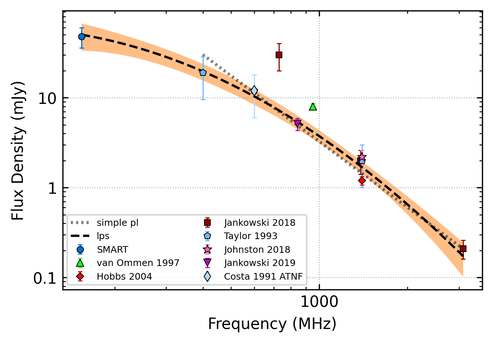

.. _J1059-5742:
J1059-5742
==========

Best Fit
--------

.. csv-table:: J1059-5742 fit results
   :header: "model","vb (MHz)","a1","a2","c","v0 (MHz)"

   "log_parabolic_spectrum","-1.02±0.37","-1.89±0.17","-2.10±0.08","691±6"

Fit Before MWA
--------------

.. csv-table:: J1059-5742 before fit results
   :header: "model","a","c","v0 (MHz)"

   "simple_power_law","-2.43±0.23","0.00±0.00","1113±11"

Flux Density Results
--------------------
.. csv-table:: J1059-5742 flux density total results
   :header: "N obs", "Flux Density (mJy)", "u_S_mean", "u_scint", "m_r_v"

   "2",  "48.0±14.9", "12.3", "13.4", "0.280"

.. csv-table:: J1059-5742 flux density individual results
   :header: "ObsID", "Flux Density (mJy)"

    "1267459328", "47.1±6.5"
    "1301240224", "49.0±10.4"

Comparison Fit
--------------
.. image:: comparison_fits/J1059-5742_comparison_fit.png
  :width: 800

Detection Plots
---------------

.. image:: on_pulse_plots/1267459328_J1059-5742_512_bins_gaussian_components.png
  :width: 800

.. image:: on_pulse_plots/1301240224_J1059-5742_128_bins_gaussian_components.png
  :width: 800