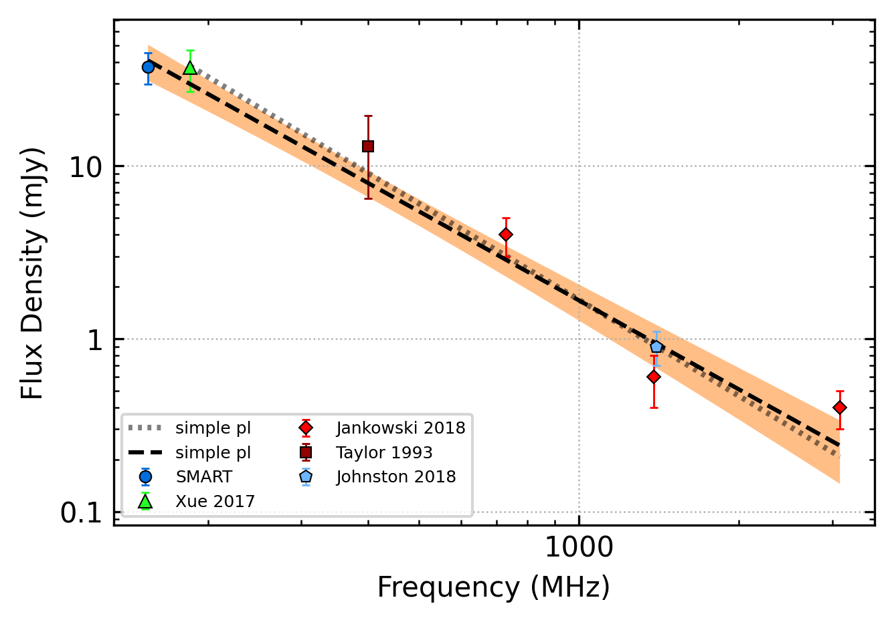
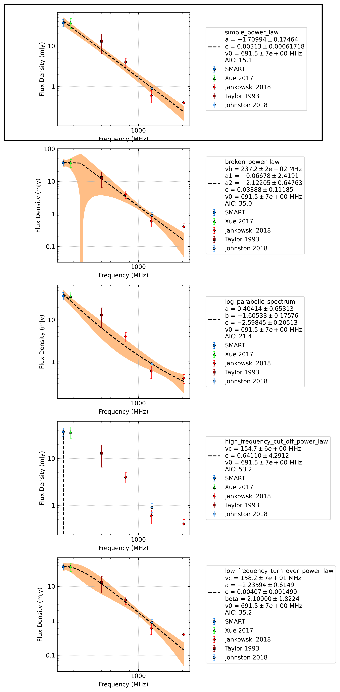
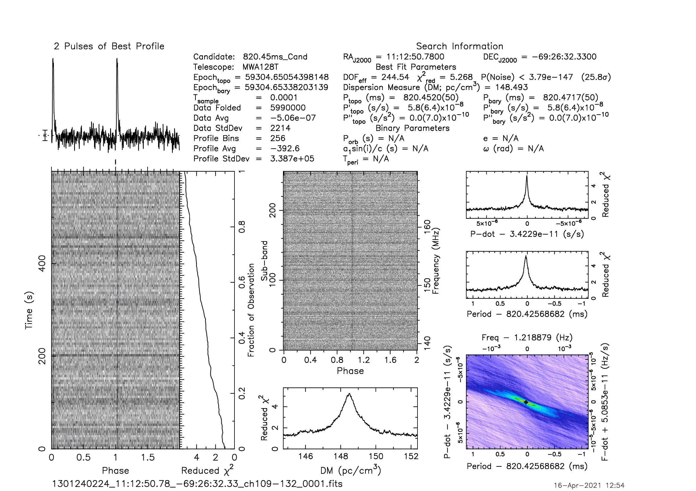

.. _J1112-6926:
J1112-6926
==========

Best Fit
--------

.. csv-table:: J1112-6926 fit results
   :header: "model","a","b","v0 (MHz)"

   "simple_power_law","-1.74±0.20","0.00±0.00","691±6"

Fit Before MWA
--------------

.. csv-table:: J1112-6926 before fit results
   :header: "model","a","b","v0 (MHz)"

   "simple_power_law","-1.85±0.25","0.00±0.00","757±7"

Flux Density Results
--------------------
.. csv-table:: J1112-6926 flux density total results
   :header: "N obs", "Flux Density (mJy)", "u_S_mean", "u_scint", "m_r_v"

   "1",  "37.5±11.9", "7.7", "9.0", "0.242"

.. csv-table:: J1112-6926 flux density individual results
   :header: "ObsID", "Flux Density (mJy)"

    "1301240224", "37.5±7.7"

Comparison Fit
--------------

Detection Plots
---------------

.. image:: on_pulse_plots/1301240224_J1112-6926_256_bins_gaussian_components.png
  :width: 800