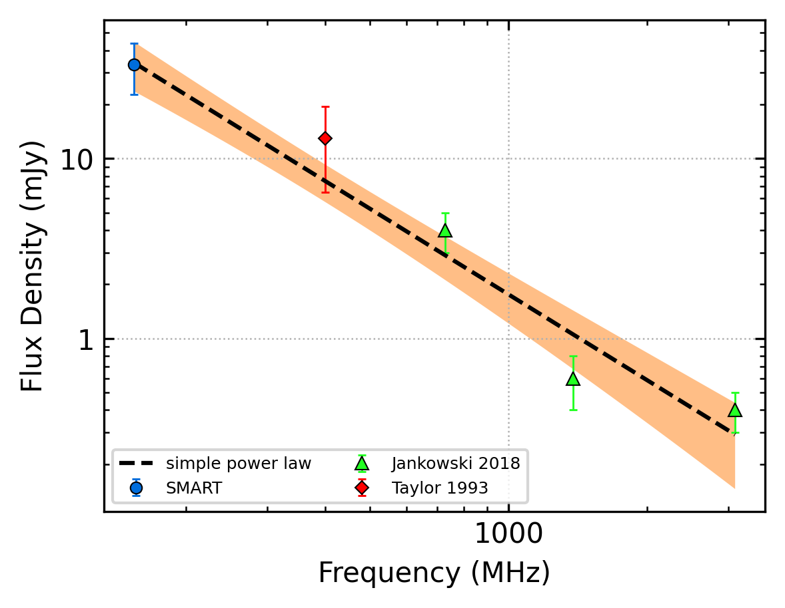
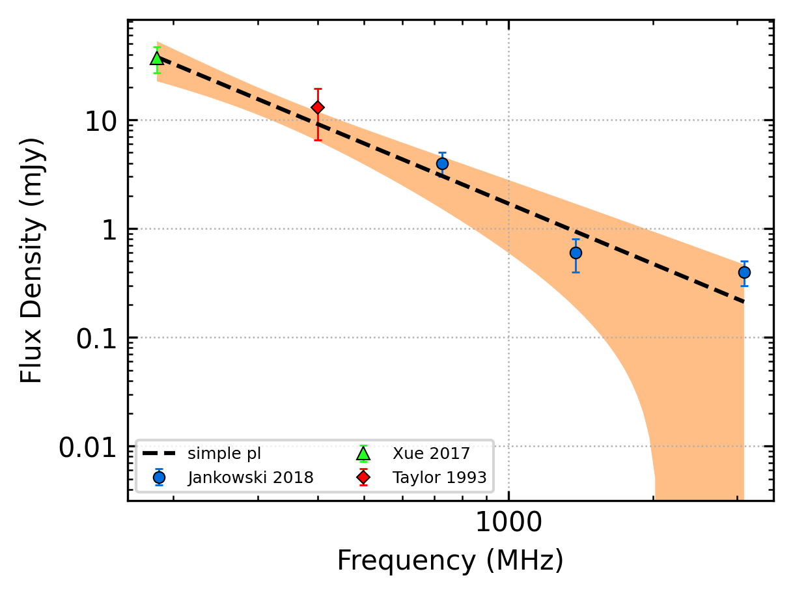

J1112-6926
==========

Best Fit
--------

.. csv-table:: J1112-6926 fit results
   :header: "model","a","b"

   "simple_power_law","-1.59±0.21","0.00±0.00"

Fit Before MWA
--------------

.. csv-table:: J1112-6926 before fit results
   :header: "model","a","b"

   "simple_power_law","-2.27±0.62","0.00±0.00"

Flux Density Results
--------------------
.. csv-table:: J1112-6926 flux density total results
   :header: "N obs", "Flux Density (mJy)", " u_S_mean", "u_scint", "m_r_v"

   "1",  "33.2±10.5", "6.8", "8.0", "0.242"

.. csv-table:: J1112-6926 flux density individual results
   :header: "ObsID", "Flux Density (mJy)"

    "1301240224", "33.2±6.8"

Comparison Fit
--------------
.. image:: comparison_fits/J1112-6926_comparison_fit.png
  :width: 800

Detection Plots
---------------

.. image:: detection_plots/pf_1301240224_J1112-6926_11:12:50.78_-69:26:32.33_b256_820.45ms_Cand.pfd.png
  :width: 800

.. image:: on_pulse_plots/1301240224_J1112-6926_256_bins_gaussian_components.png
  :width: 800