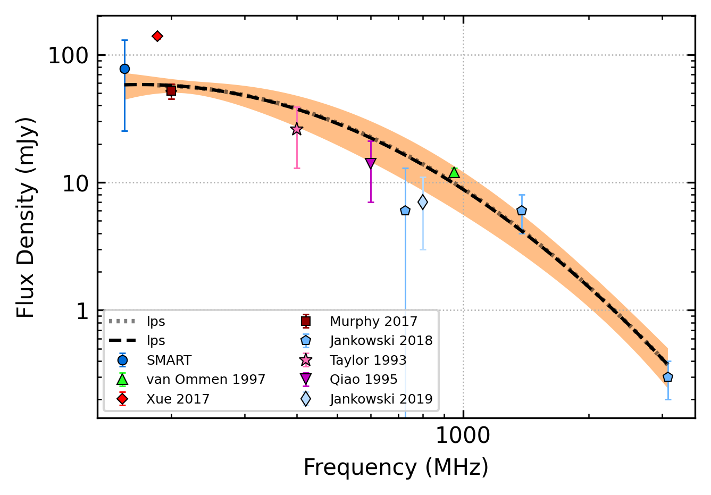
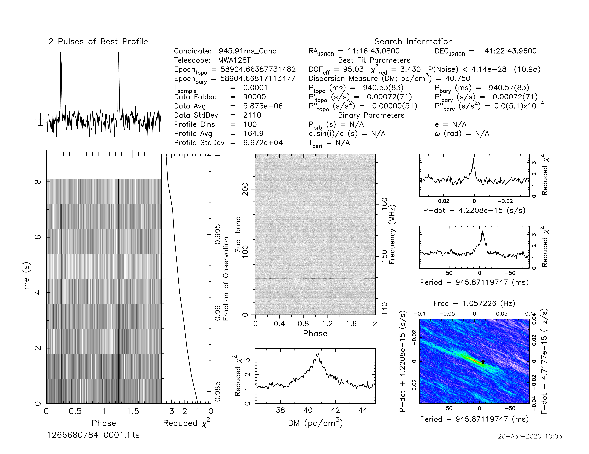
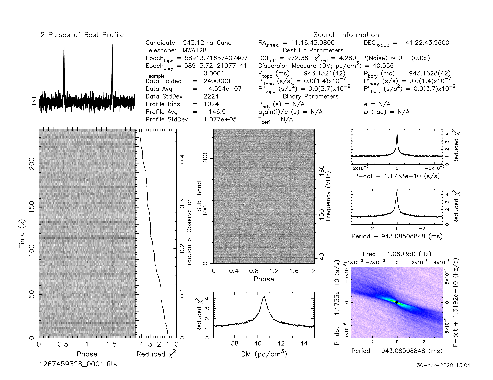
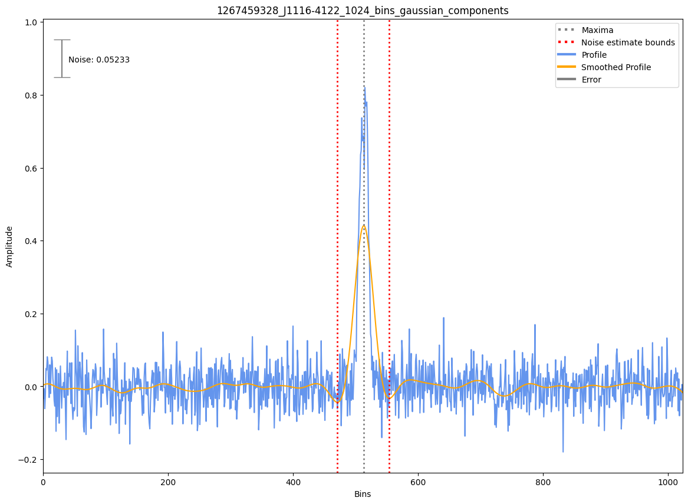

.. _J1116-4122:
J1116-4122
==========

Best Fit
--------

.. csv-table:: J1116-4122 fit results
   :header: "model","vb (MHz)","a1","a2","b","v0 (MHz)"

   "broken_power_law","1181±194","-1.34±0.34","-3.44±0.66","0.02±0.00","691±6"

Fit Before MWA
--------------

.. csv-table:: J1116-4122 before fit results
   :header: "model","vb (MHz)","a1","a2","b","v0 (MHz)"

   "broken_power_law","1219±203","-1.53±0.09","-3.44±0.66","0.02±0.00","757±7"

Flux Density Results
--------------------
.. csv-table:: J1116-4122 flux density total results
   :header: "N obs", "Flux Density (mJy)", "u_S_mean", "u_scint", "m_r_v"

   "2",  "77.9±52.6", "45.3", "34.7", "0.445"

.. csv-table:: J1116-4122 flux density individual results
   :header: "ObsID", "Flux Density (mJy)"

    "1266680784", "101.5±44.5"
    "1267459328", "54.3±8.3"

Comparison Fit
--------------
.. image:: comparison_fits/J1116-4122_comparison_fit.png
  :width: 800

Detection Plots
---------------

.. image:: on_pulse_plots/1266680784_J1116-4122_100_bins_gaussian_components.png
  :width: 800

