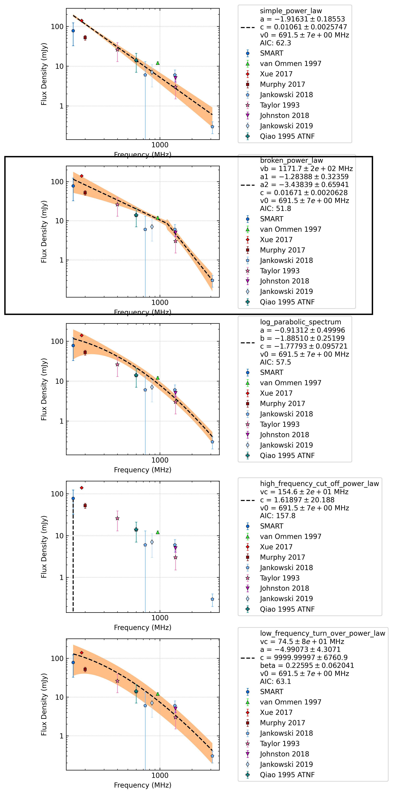

.. _J1116-4122:
J1116-4122
==========

Best Fit
--------
.. image:: best_fits/J1116-4122_broken_power_law_fit.png
  :width: 800

.. csv-table:: J1116-4122 fit results
   :header: "model","vb (MHz)","a1","a2","b"

   "broken_power_law","1228±172","-0.94±0.09","-3.71±0.58","0.01±0.00"

Fit Before MWA
--------------
.. image:: before_mwa/J1116-4122_broken_power_law_fit.png
  :width: 800

.. csv-table:: J1116-4122 before fit results
   :header: "model","vb (MHz)","a1","a2","b"

   "broken_power_law","1227±173","-0.94±0.10","-3.71±0.58","0.01±0.00"

Flux Density Results
--------------------
.. csv-table:: J1116-4122 flux density total results
   :header: "N obs", "Flux Density (mJy)", "u_S_mean", "u_scint", "m_r_v"

   "2",  "68.2±46.4", "39.9", "30.3", "0.445"

.. csv-table:: J1116-4122 flux density individual results
   :header: "ObsID", "Flux Density (mJy)"

    "1266680784", "89.6±39.3"
    "1267459328", "46.8±7.1"

Comparison Fit
--------------

Detection Plots
---------------

.. image:: detection_plots/1266680784_J1116-4122.prepfold.png
  :width: 800

.. image:: on_pulse_plots/1266680784_J1116-4122_100_bins_gaussian_components.png
  :width: 800
.. image:: detection_plots/1267459328_J1116-4122.prepfold.png
  :width: 800

.. image:: on_pulse_plots/1267459328_J1116-4122_1024_bins_gaussian_components.png
  :width: 800