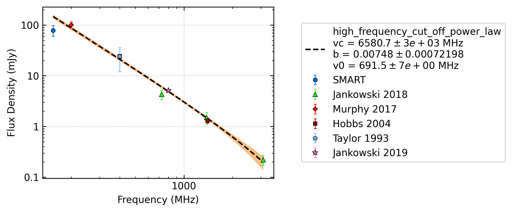
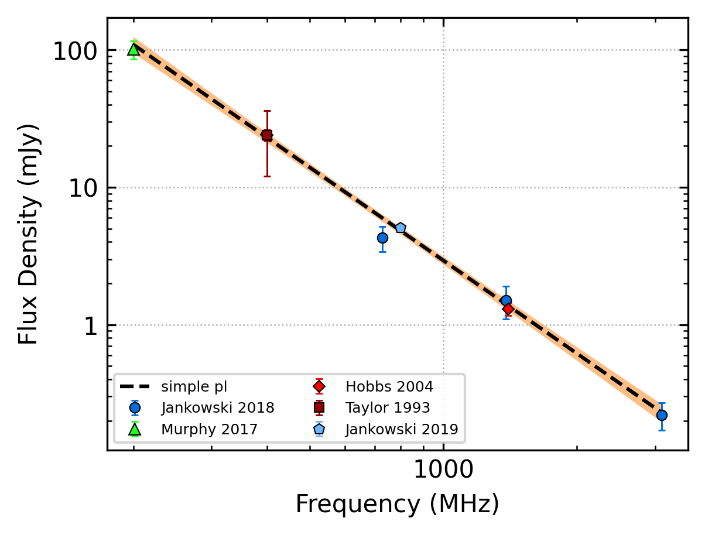
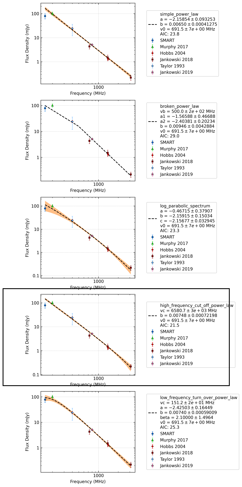
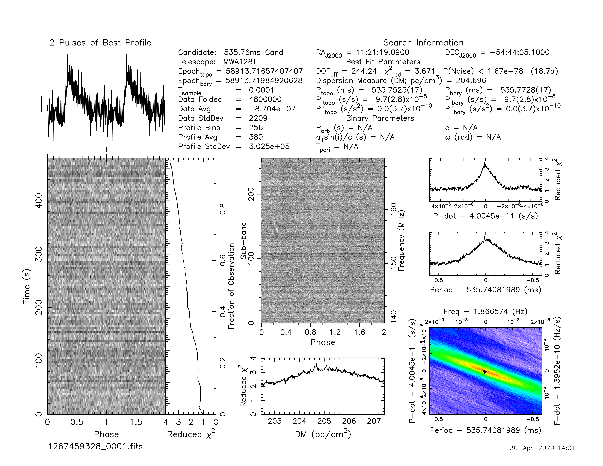

.. _J1121-5444:
J1121-5444
==========

Best Fit
--------

.. csv-table:: J1121-5444 fit results
   :header: "model","vc (MHz)","b","v0 (MHz)"

   "high_frequency_cut_off_power_law","6580±2804","0.01±0.00","691±6"

Fit Before MWA
--------------

.. csv-table:: J1121-5444 before fit results
   :header: "model","a","b","v0 (MHz)"

   "simple_power_law","-2.25±0.09","0.01±0.00","787±7"

Flux Density Results
--------------------
.. csv-table:: J1121-5444 flux density total results
   :header: "N obs", "Flux Density (mJy)", "u_S_mean", "u_scint", "m_r_v"

   "1",  "78.6±18.5", "8.8", "16.3", "0.208"

.. csv-table:: J1121-5444 flux density individual results
   :header: "ObsID", "Flux Density (mJy)"

    "1267459328", "78.6±8.8"

Comparison Fit
--------------

Detection Plots
---------------

.. image:: on_pulse_plots/1267459328_J1121-5444_256_bins_gaussian_components.png
  :width: 800