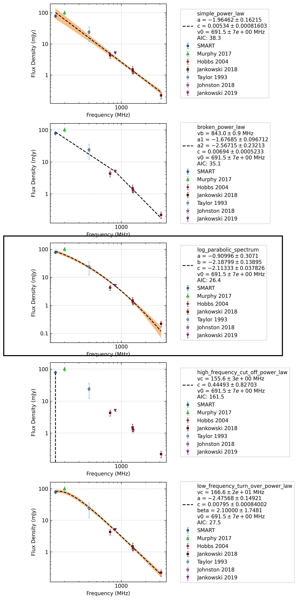

J1121-5444
==========

Best Fit
--------
.. image:: best_fits/J1121-5444_broken_power_law_fit.png
  :width: 800

.. csv-table:: J1121-5444 fit results
   :header: "model","vb (MHz)","a1","a2","b"

   "broken_power_law","208±11","1.51±0.82","-2.30±0.09","1.71±2.24"

Fit Before MWA
--------------
.. image:: before_mwa/J1121-5444_simple_power_law_fit.png
  :width: 800

.. csv-table:: J1121-5444 before fit results
   :header: "model","a","b"

   "simple_power_law","-2.25±0.08","0.00±0.00"

Flux Density Results
--------------------
.. csv-table:: J1121-5444 flux density total results
   :header: "N obs", "Flux Density (mJy)", " u_S_mean", "u_scint", "m_r_v"

   "1",  "68.1±16.1", "7.6", "14.1", "0.208"

.. csv-table:: J1121-5444 flux density individual results
   :header: "ObsID", "Flux Density (mJy)"

    "1267459328", "68.1±7.6"

Comparison Fit
--------------

Detection Plots
---------------

.. image:: on_pulse_plots/1267459328_J1121-5444_256_bins_gaussian_components.png
  :width: 800