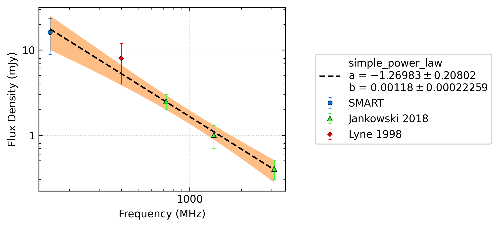
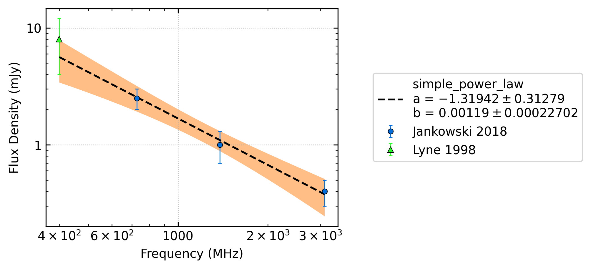

J1123-4844
==========

Best Fit
--------

.. csv-table:: J1123-4844 fit results
   :header: "model","a","b"

   "simple_power_law","-1.23±0.15","0.00±0.00"

Fit Before MWA
--------------

.. csv-table:: J1123-4844 before fit results
   :header: "model","a","b"

   "simple_power_law","-1.31±0.23","0.00±0.00"

Flux Density Results
--------------------
.. csv-table:: J1123-4844 flux density total results
   :header: "N obs", "Flux Density (mJy)", "u_S_mean", "u_scint", "m_r_v"

   "1",  "14.0±6.3", "4.7", "4.2", "0.301"

.. csv-table:: J1123-4844 flux density individual results
   :header: "ObsID", "Flux Density (mJy)"

    "1267459328", "14.0±4.7"

Comparison Fit
--------------
.. image:: comparison_fits/J1123-4844_comparison_fit.png
  :width: 800

Detection Plots
---------------

.. image:: detection_plots/1267459328_J1123-4844.prepfold.png
  :width: 800

.. image:: on_pulse_plots/1267459328_J1123-4844_128_bins_gaussian_components.png
  :width: 800