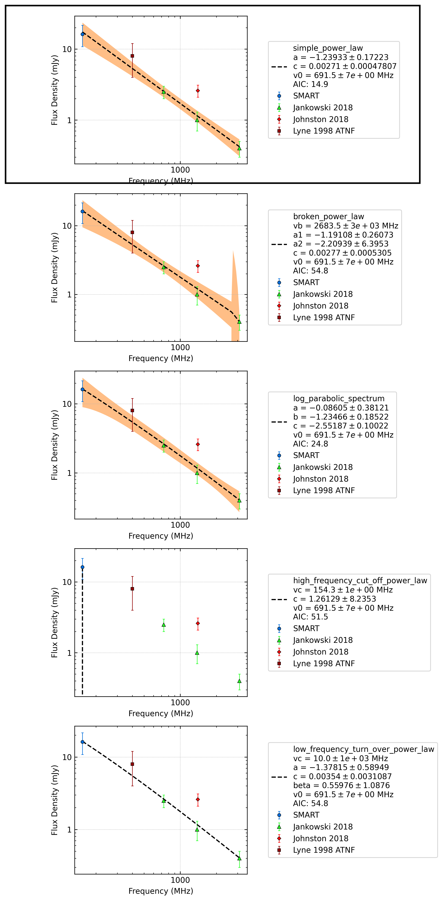

.. _J1123-4844:
J1123-4844
==========

Best Fit
--------
.. image:: best_fits/J1123-4844_i_fit.png
  :width: 800

.. csv-table:: J1123-4844 fit results
   :header: "model","a","b","v0 (MHz)"

   "i","-1.27±0.21","0.00±0.00","691±6"

Fit Before MWA
--------------

.. csv-table:: J1123-4844 before fit results
   :header: "model","a","b","v0 (MHz)"

   "i","-1.32±0.31","0.00±0.00","1113±11"

Flux Density Results
--------------------
.. csv-table:: J1123-4844 flux density total results
   :header: "N obs", "Flux Density (mJy)", "u_S_mean", "u_scint", "m_r_v"

   "1",  "16.2±7.3", "5.4", "4.9", "0.301"

.. csv-table:: J1123-4844 flux density individual results
   :header: "ObsID", "Flux Density (mJy)"

    "1267459328", "16.2±5.4"

Comparison Fit
--------------

Detection Plots
---------------

.. image:: detection_plots/1267459328_J1123-4844.prepfold.png
  :width: 800

.. image:: on_pulse_plots/1267459328_J1123-4844_128_bins_gaussian_components.png
  :width: 800