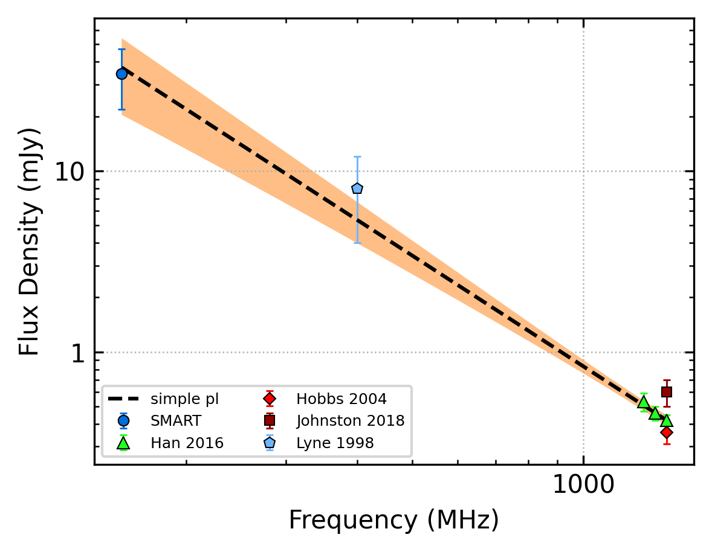
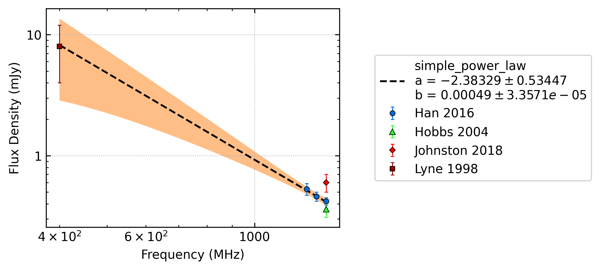
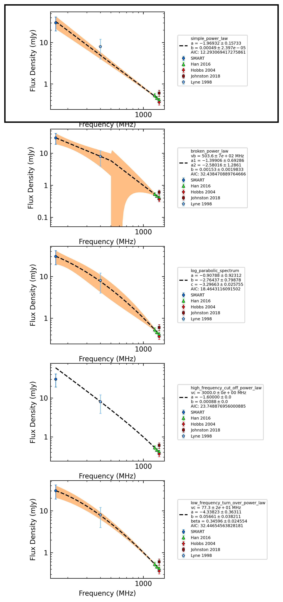
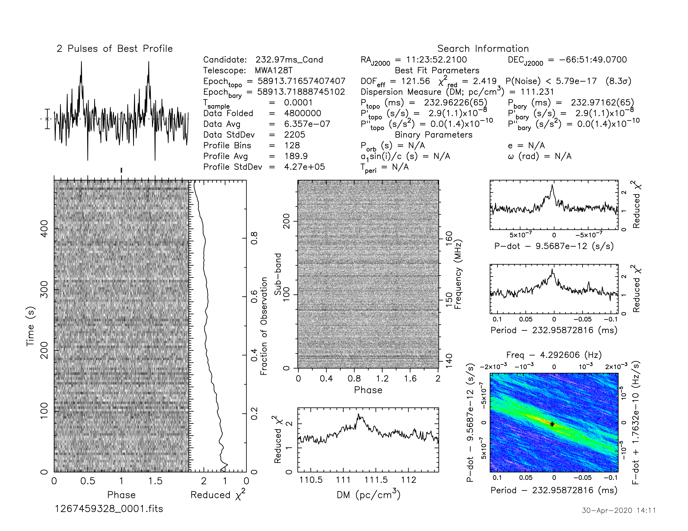
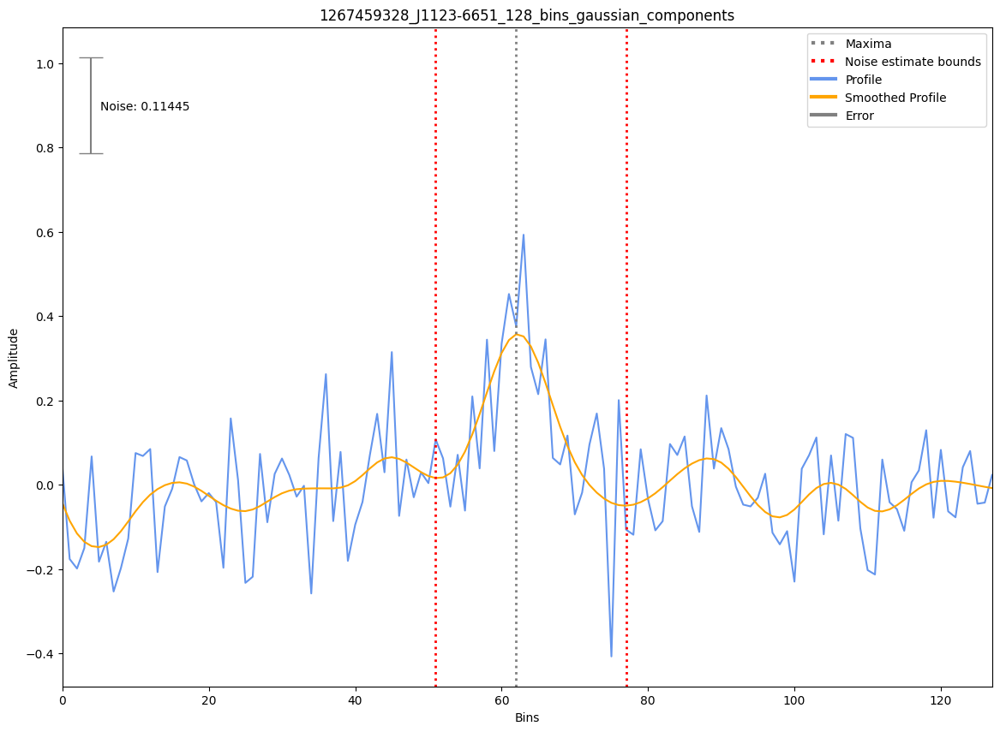
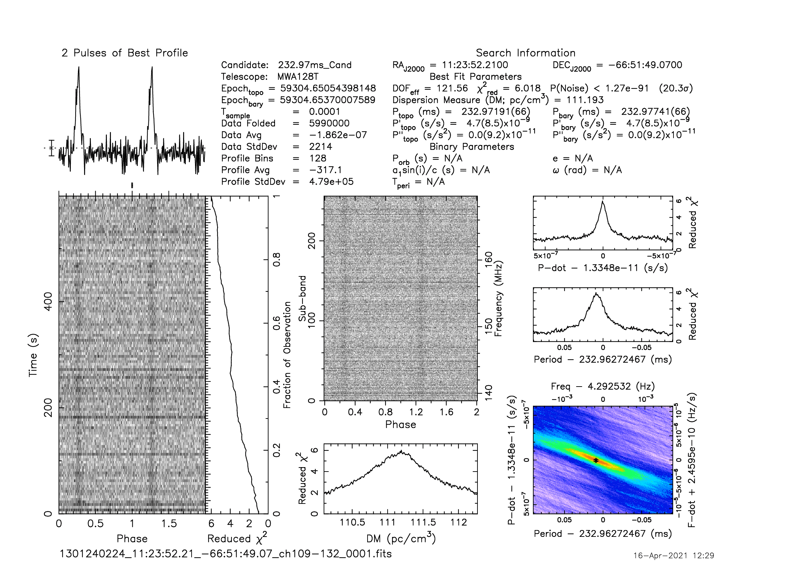

.. _J1123-6651:
J1123-6651
==========

Best Fit
--------

.. csv-table:: J1123-6651 fit results
   :header: "model","a","b"

   "simple_power_law","-2.03±0.21","0.00±0.00"

Fit Before MWA
--------------

.. csv-table:: J1123-6651 before fit results
   :header: "model","a","b"

   "simple_power_law","-2.38±0.53","0.00±0.00"

Flux Density Results
--------------------
.. csv-table:: J1123-6651 flux density total results
   :header: "N obs", "Flux Density (mJy)", "u_S_mean", "u_scint", "m_r_v"

   "2",  "34.5±12.6", "10.4", "9.5", "0.277"

.. csv-table:: J1123-6651 flux density individual results
   :header: "ObsID", "Flux Density (mJy)"

    "1267459328", "28.6±6.5"
    "1301240224", "40.3±8.1"

Comparison Fit
--------------

Detection Plots
---------------

.. image:: on_pulse_plots/1301240224_J1123-6651_128_bins_gaussian_components.png
  :width: 800