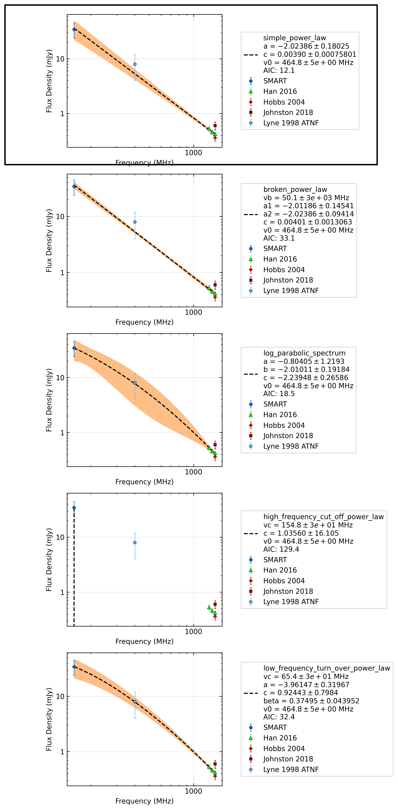

J1123-6651
==========

Best Fit
--------
.. image:: best_fits/J1123-6651_simple_power_law_fit.png
  :width: 800

.. csv-table:: J1123-6651 fit results
   :header: "model","a","b"

   "simple_power_law","-1.97±0.16","0.00±0.00"

Fit Before MWA
--------------
.. image:: before_mwa/J1123-6651_simple_power_law_fit.png
  :width: 800

.. csv-table:: J1123-6651 before fit results
   :header: "model","a","b"

   "simple_power_law","-2.38±0.38","0.00±0.00"

Flux Density Results
--------------------
.. csv-table:: J1123-6651 flux density total results
   :header: "N obs", "Flux Density (mJy)", "u_S_mean", "u_scint", "m_r_v"

   "2",  "30.3±11.1", "9.1", "8.4", "0.277"

.. csv-table:: J1123-6651 flux density individual results
   :header: "ObsID", "Flux Density (mJy)"

    "1267459328", "24.8±5.6"
    "1301240224", "35.7±7.2"

Comparison Fit
--------------

Detection Plots
---------------

.. image:: detection_plots/1267459328_J1123-6651.prepfold.png
  :width: 800

.. image:: on_pulse_plots/1267459328_J1123-6651_128_bins_gaussian_components.png
  :width: 800

.. image:: on_pulse_plots/1301240224_J1123-6651_128_bins_gaussian_components.png
  :width: 800