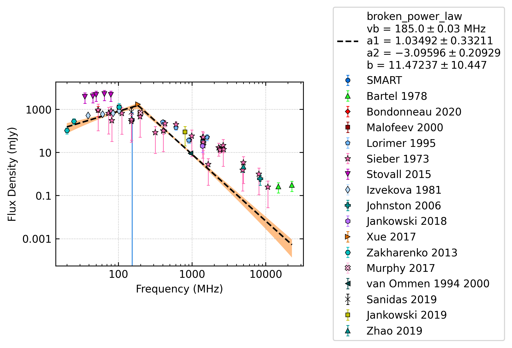
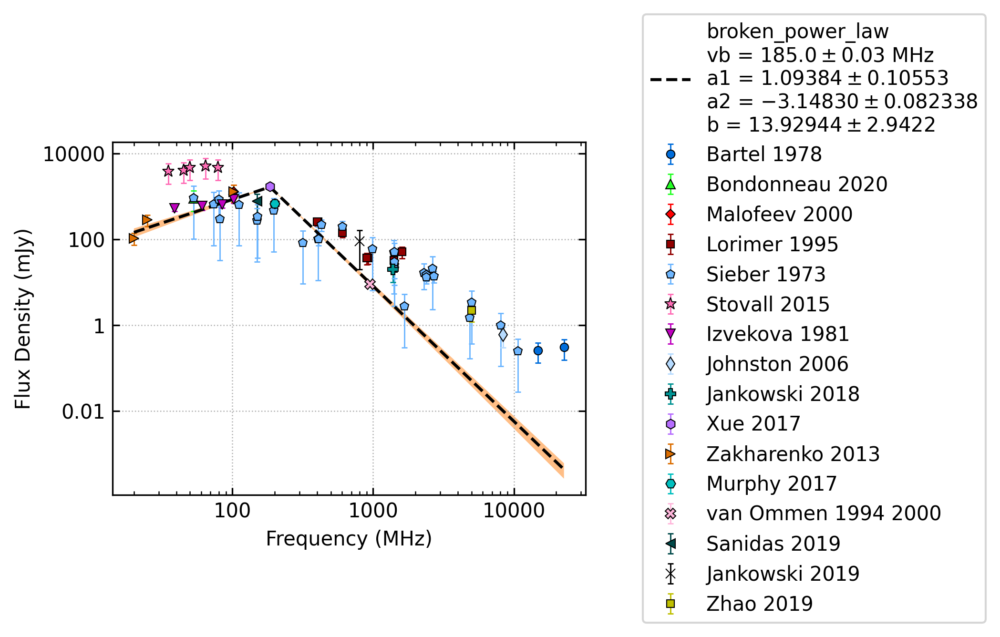
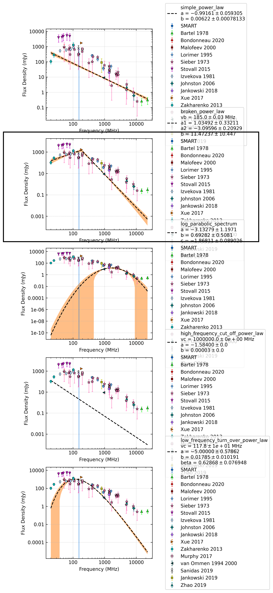
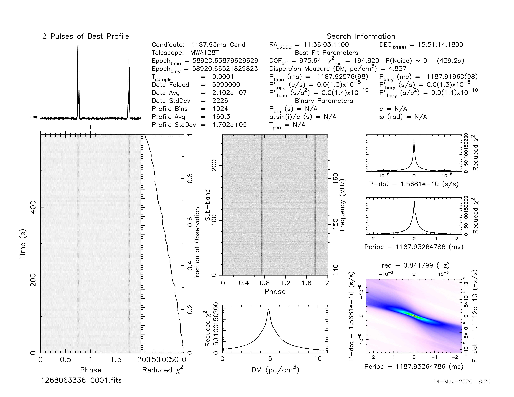
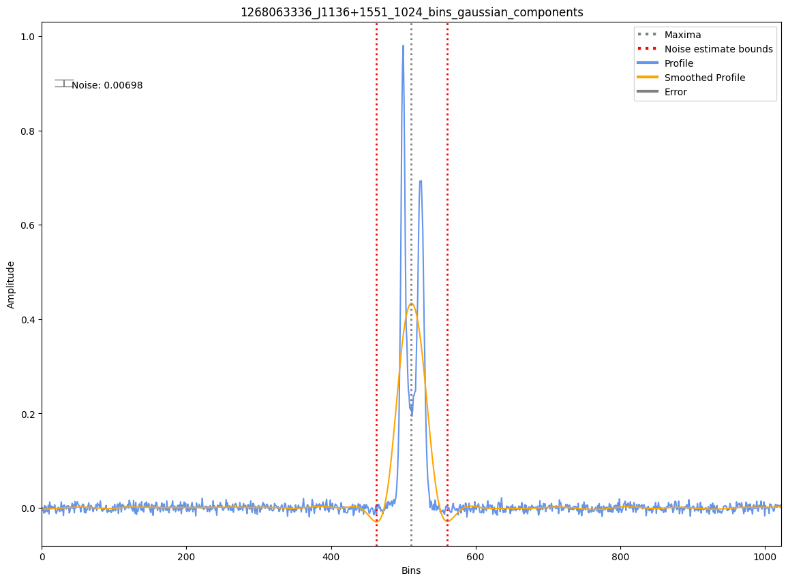

.. _J1136+1551:
J1136+1551
==========

Best Fit
--------

.. csv-table:: J1136+1551 fit results
   :header: "model","vb (MHz)","a1","a2","b"

   "broken_power_law","176±12","0.67±0.18","-2.75±0.08","3.64±1.98"

Fit Before MWA
--------------

.. csv-table:: J1136+1551 before fit results
   :header: "model","vb (MHz)","a1","a2","b"

   "broken_power_law","572±27","-0.07±0.10","-6.30±0.53","0.21±0.05"

Flux Density Results
--------------------
.. csv-table:: J1136+1551 flux density total results
   :header: "N obs", "Flux Density (mJy)", "u_S_mean", "u_scint", "m_r_v"

   "1",  "272.7±330.7", "31.6", "329.2", "1.207"

.. csv-table:: J1136+1551 flux density individual results
   :header: "ObsID", "Flux Density (mJy)"

    "1268063336", "272.7±31.6"

Comparison Fit
--------------

Detection Plots
---------------

