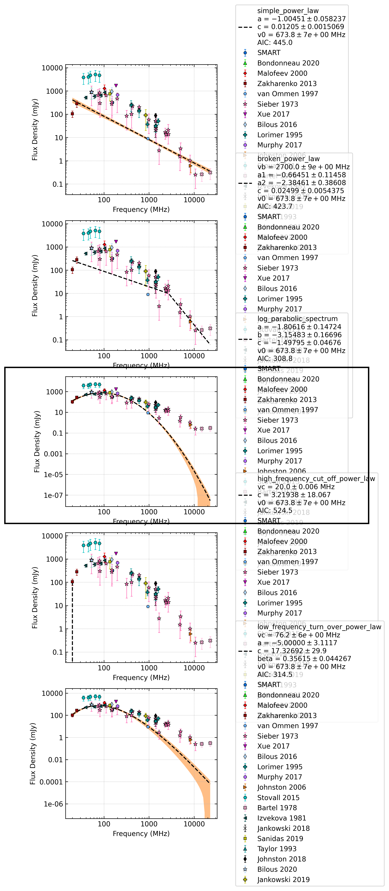

.. _J1136+1551:
J1136+1551
==========

Best Fit
--------

.. csv-table:: J1136+1551 fit results
   :header: "model","a","b","c","v0 (MHz)"

   "log_parabolic_spectrum","-2.13±0.14","-3.50±0.14","-1.43±0.04","673±6"

Fit Before MWA
--------------

.. csv-table:: J1136+1551 before fit results
   :header: "model","a","b","c","v0 (MHz)"

   "log_parabolic_spectrum","-2.14±0.14","-3.51±0.14","-1.43±0.04","673±6"

Flux Density Results
--------------------
.. csv-table:: J1136+1551 flux density total results
   :header: "N obs", "Flux Density (mJy)", "u_S_mean", "u_scint", "m_r_v"

   "1",  "318.1±385.7", "36.9", "384.0", "1.207"

.. csv-table:: J1136+1551 flux density individual results
   :header: "ObsID", "Flux Density (mJy)"

    "1268063336", "318.1±36.9"

Comparison Fit
--------------

Detection Plots
---------------

.. image:: detection_plots/1268063336_J1136+1551_c1268063056_b1024.prepfold.png
  :width: 800

.. image:: on_pulse_plots/1268063336_J1136+1551_1024_bins_gaussian_components.png
  :width: 800