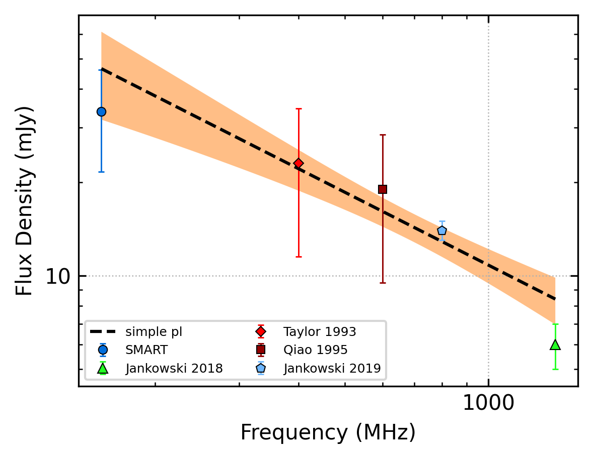
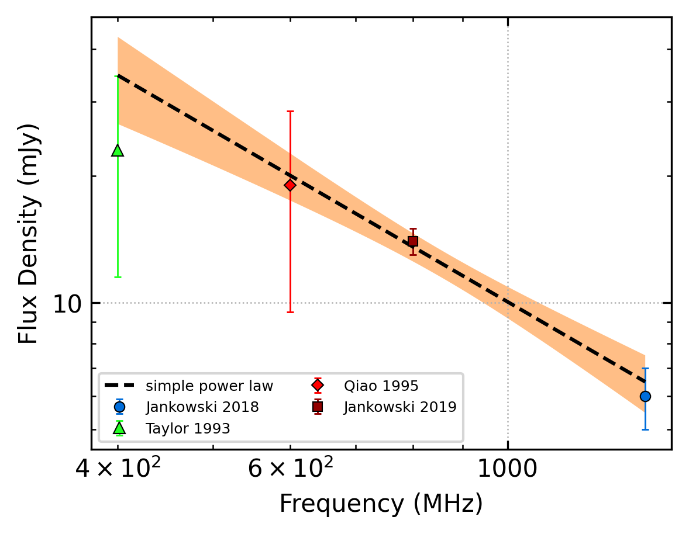

J1136-5525
==========

Best Fit
--------

.. csv-table:: J1136-5525 fit results
   :header: "model","a","b"

   "simple_power_law","-0.71±0.21","0.01±0.00"

Fit Before MWA
--------------

.. csv-table:: J1136-5525 before fit results
   :header: "model","a","b"

   "simple_power_law","-1.35±0.29","0.01±0.00"

Flux Density Results
--------------------
.. csv-table:: J1136-5525 flux density total results
   :header: "N obs", "Flux Density (mJy)", " u_S_mean", "u_scint", "m_r_v"

   "1",  "29.3±10.6", "5.3", "9.2", "0.314"

.. csv-table:: J1136-5525 flux density individual results
   :header: "ObsID", "Flux Density (mJy)"

    "1267459328", "29.3±5.3"

Comparison Fit
--------------
.. image:: comparison_fits/J1136-5525_comparison_fit.png
  :width: 800

Detection Plots
---------------

.. image:: detection_plots/1267459328_J1136-5525.prepfold.png
  :width: 800

.. image:: on_pulse_plots/1267459328_J1136-5525_256_bins_gaussian_components.png
  :width: 800