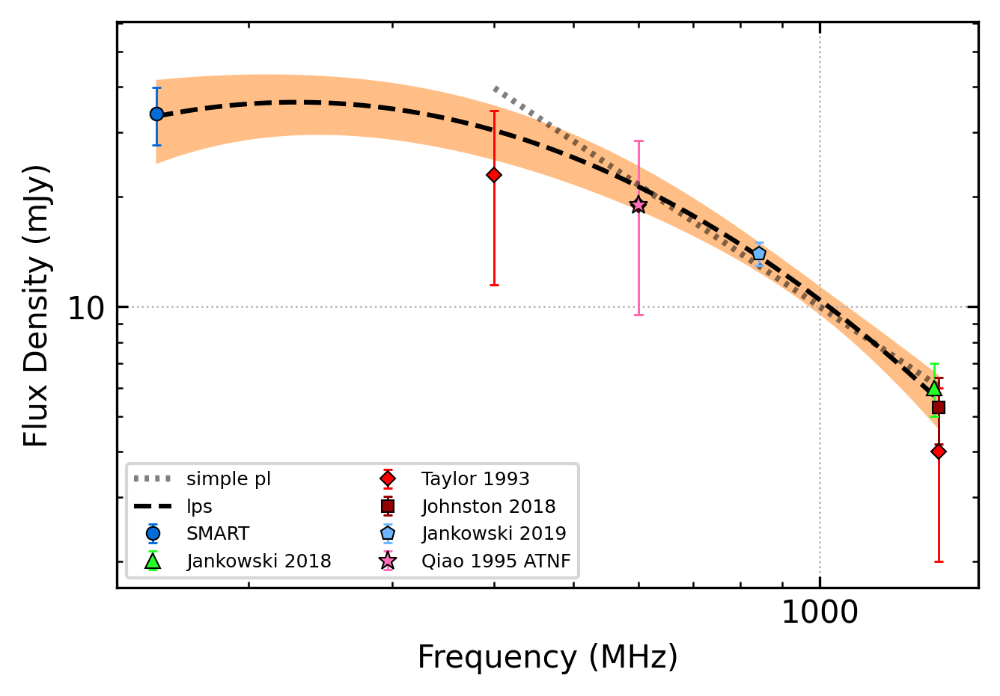
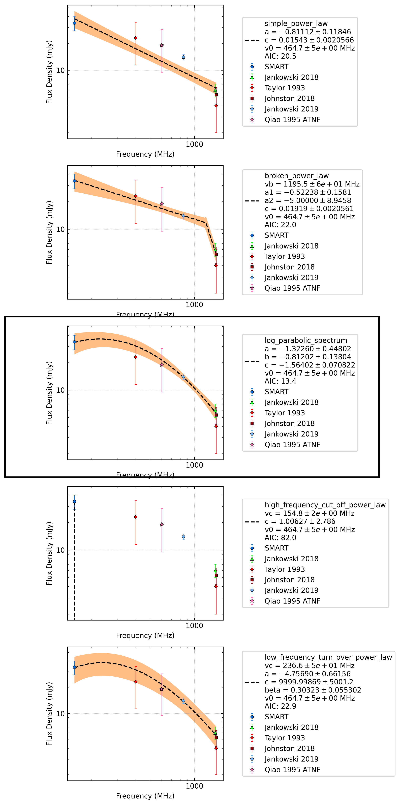

.. _J1136-5525:
J1136-5525
==========

Best Fit
--------

.. csv-table:: J1136-5525 fit results
   :header: "model","a","b","v0 (MHz)"

   "simple_power_law","-0.78±0.20","0.02±0.00","461±4"

Fit Before MWA
--------------

.. csv-table:: J1136-5525 before fit results
   :header: "model","a","b","v0 (MHz)"

   "simple_power_law","-1.32±0.33","0.01±0.00","743±7"

Flux Density Results
--------------------
.. csv-table:: J1136-5525 flux density total results
   :header: "N obs", "Flux Density (mJy)", "u_S_mean", "u_scint", "m_r_v"

   "1",  "33.8±12.2", "6.1", "10.6", "0.314"

.. csv-table:: J1136-5525 flux density individual results
   :header: "ObsID", "Flux Density (mJy)"

    "1267459328", "33.8±6.1"

Comparison Fit
--------------

Detection Plots
---------------

.. image:: detection_plots/1267459328_J1136-5525.prepfold.png
  :width: 800

.. image:: on_pulse_plots/1267459328_J1136-5525_256_bins_gaussian_components.png
  :width: 800