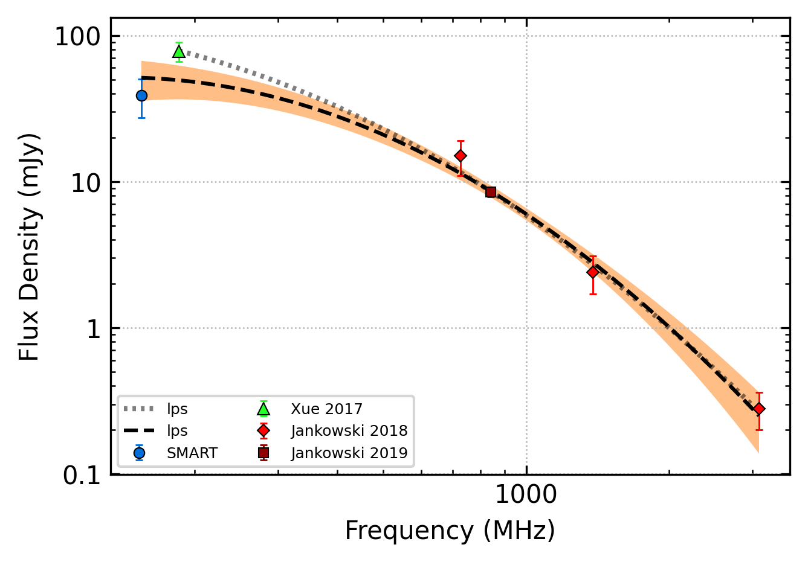
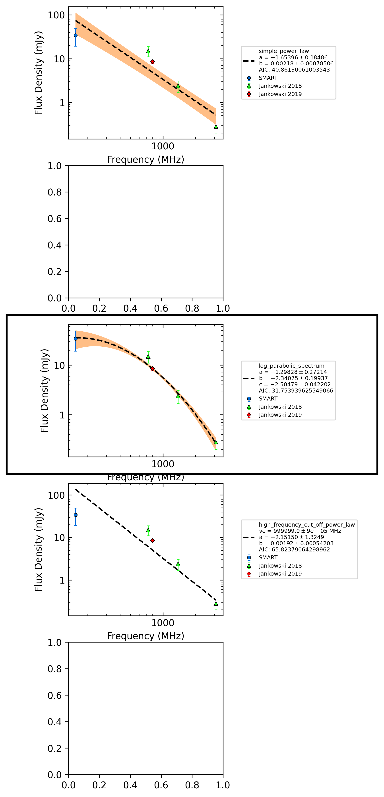
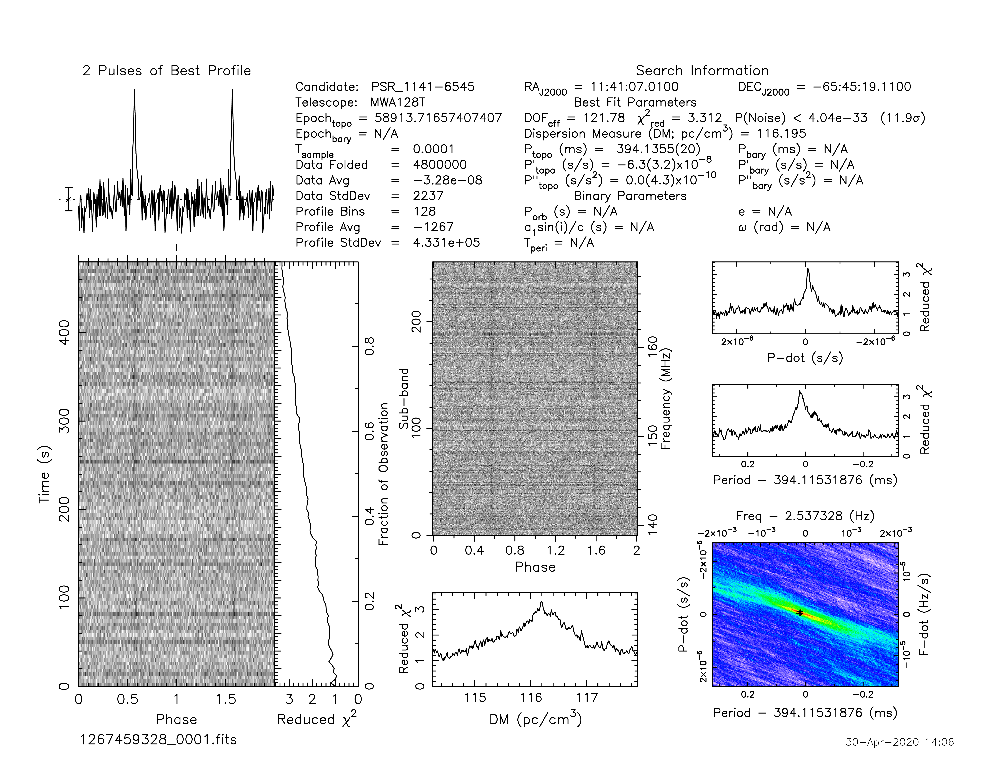
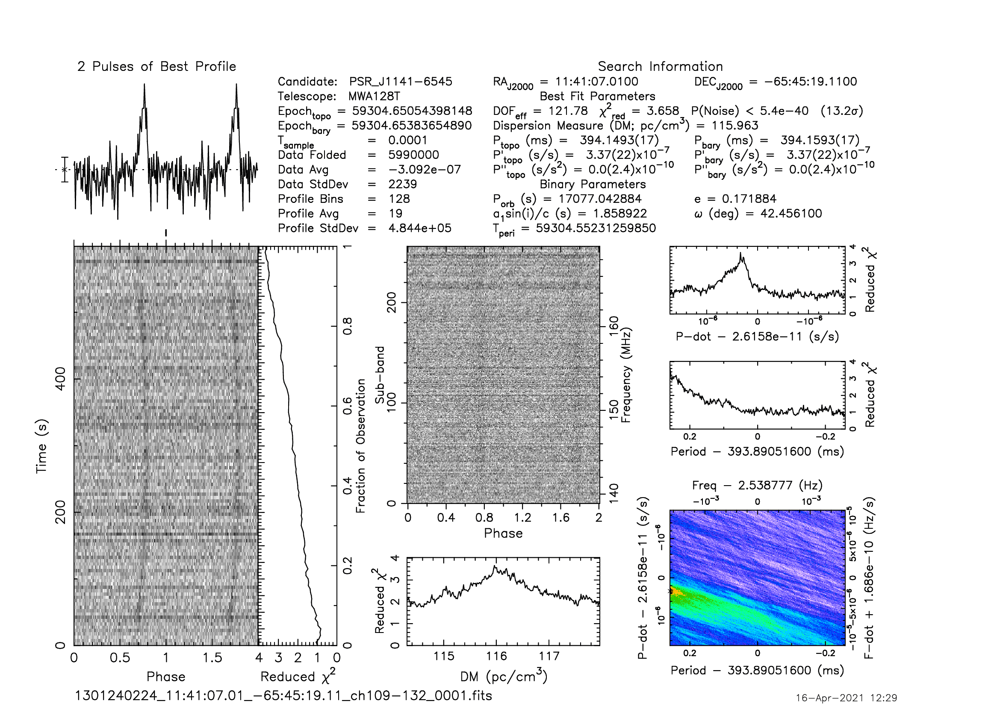
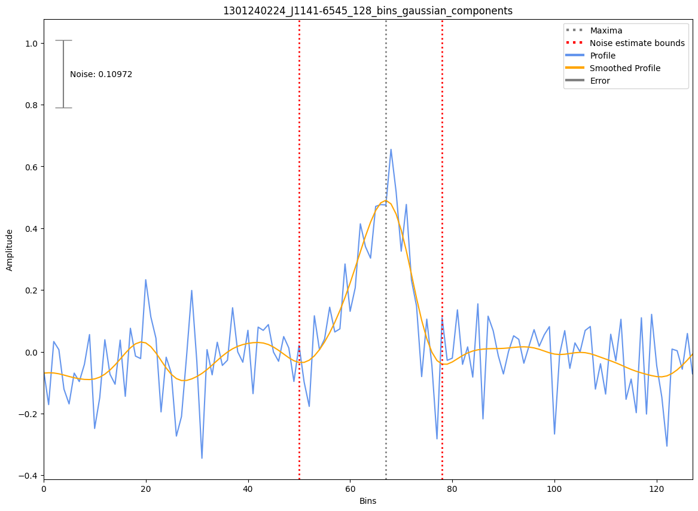

.. _J1141-6545:
J1141-6545
==========

Best Fit
--------

.. csv-table:: J1141-6545 fit results
   :header: "model","a","b","c","v0 (MHz)"

   "log_parabolic_spectrum","-1.14±0.34","-1.87±0.17","-1.90±0.05","691±6"

Fit Before MWA
--------------

.. csv-table:: J1141-6545 before fit results
   :header: "model","a","b","c","v0 (MHz)"

   "log_parabolic_spectrum","-0.98±0.31","-2.02±0.16","-1.97±0.04","757±7"

Flux Density Results
--------------------
.. csv-table:: J1141-6545 flux density total results
   :header: "N obs", "Flux Density (mJy)", "u_S_mean", "u_scint", "m_r_v"

   "2",  "38.8±16.8", "11.4", "10.5", "0.271"

.. csv-table:: J1141-6545 flux density individual results
   :header: "ObsID", "Flux Density (mJy)"

    "1267459328", "22.8±6.3"
    "1301240224", "54.9±9.5"

Comparison Fit
--------------

Detection Plots
---------------

.. image:: on_pulse_plots/1267459328_J1141-6545_128_bins_gaussian_components.png
  :width: 800

