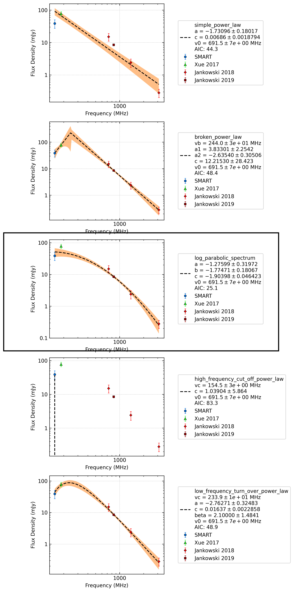

J1141-6545
==========

Best Fit
--------
.. image:: best_fits/J1141-6545_log_parabolic_spectrum_fit.png
  :width: 800

.. csv-table:: J1141-6545 fit results
   :header: "model","a","b","c"

   "log_parabolic_spectrum","-1.30±0.27","-2.34±0.20","-2.50±0.04"

Fit Before MWA
--------------
.. image:: before_mwa/J1141-6545_simple_power_law_fit.png
  :width: 800

.. csv-table:: J1141-6545 before fit results
   :header: "model","a","b"

   "simple_power_law","-2.52±0.21","0.00±0.00"

Flux Density Results
--------------------
.. csv-table:: J1141-6545 flux density total results
   :header: "N obs", "Flux Density (mJy)", "u_S_mean", "u_scint", "m_r_v"

   "2",  "34.2±15.0", "10.1", "9.3", "0.271"

.. csv-table:: J1141-6545 flux density individual results
   :header: "ObsID", "Flux Density (mJy)"

    "1267459328", "19.7±5.5"
    "1301240224", "48.7±8.4"

Comparison Fit
--------------

Detection Plots
---------------

.. image:: on_pulse_plots/1267459328_J1141-6545_128_bins_gaussian_components.png
  :width: 800
.. image:: detection_plots/pf_1301240224_J1141-6545_11:41:07.01_-65:45:19.11_b128_PSR_J1141-6545.pfd.png
  :width: 800

.. image:: on_pulse_plots/1301240224_J1141-6545_128_bins_gaussian_components.png
  :width: 800