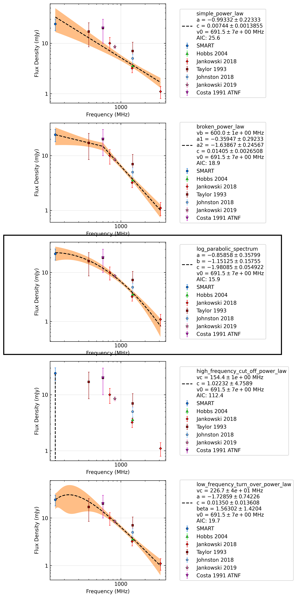

J1146-6030
==========

Best Fit
--------
.. image:: best_fits/J1146-6030_log_parabolic_spectrum_fit.png
  :width: 800

.. csv-table:: J1146-6030 fit results
   :header: "model","a","b","c"

   "log_parabolic_spectrum","-0.88±0.36","-1.61±0.28","-2.38±0.04"

Fit Before MWA
--------------
.. image:: before_mwa/J1146-6030_simple_power_law_fit.png
  :width: 800

.. csv-table:: J1146-6030 before fit results
   :header: "model","a","b"

   "simple_power_law","-1.52±0.16","0.00±0.00"

Flux Density Results
--------------------
.. csv-table:: J1146-6030 flux density total results
   :header: "N obs", "Flux Density (mJy)", "u_S_mean", "u_scint", "m_r_v"

   "1",  "20.9±7.8", "5.3", "5.8", "0.276"

.. csv-table:: J1146-6030 flux density individual results
   :header: "ObsID", "Flux Density (mJy)"

    "1267459328", "20.9±5.3"

Comparison Fit
--------------

Detection Plots
---------------

.. image:: detection_plots/1267459328_J1146-6030.prepfold.png
  :width: 800

.. image:: on_pulse_plots/1267459328_J1146-6030_128_bins_gaussian_components.png
  :width: 800